# Chương 1 Giới thiệu đề tài

## 1.1 Lý do chọn đề tài

- Trong bối cảnh chuyển đổi số đang diễn ra mạnh mẽ trong mọi lĩnh vực, việc ứng dụng công nghệ thông tin vào công tác quản lý là xu hướng tất yếu nhằm nâng cao hiệu quả hoạt động và chất lượng phục vụ. Thư viện – với vai trò là trung tâm lưu trữ, khai thác và cung cấp tri thức – cũng không nằm ngoài xu hướng đó.
- Thực tế cho thấy, tại nhiều thư viện hiện nay, công tác quản lý sách, độc giả, mượn – trả sách vẫn còn được thực hiện thủ công hoặc bằng các công cụ đơn giản, dẫn đến nhiều hạn chế như: khó kiểm soát số lượng sách, dễ xảy ra sai sót trong quá trình mượn – trả, tốn nhiều thời gian cho thủ thư và gây bất tiện cho người đọc. Ngoài ra, việc thống kê, báo cáo và tra cứu thông tin chưa thực sự hiệu quả, ảnh hưởng đến chất lượng quản lý và phục vụ.
- Xuất phát từ những vấn đề trên, việc xây dựng Hệ thống quản lý thư viện là cần thiết và có ý nghĩa thực tiễn cao. Hệ thống giúp tự động hóa các nghiệp vụ chính của thư viện như: quản lý sách, quản lý bạn đọc, quản lý mượn – trả, xử lý quá hạn, tra cứu và thống kê báo cáo. Qua đó, góp phần giảm thiểu sai sót, tiết kiệm thời gian, nâng cao hiệu quả quản lý và chất lượng dịch vụ thư viện.
- Bên cạnh đó, đề tài còn giúp nhóm vận dụng kiến thức đã học về phân tích và thiết kế hệ thống thông tin, mô hình hóa nghiệp vụ, xây dựng sơ đồ UML và thiết kế cơ sở dữ liệu. Vì vậy, nhóm quyết định lựa chọn đề tài “Hệ thống quản lý thư viện” để nghiên cứu và thực hiện.

## 1.2 Mục tiêu của hệ thống

Hệ thống quản lý thư viện được xây dựng nhằm ứng dụng công nghệ thông tin để tự động hóa và tối ưu hóa các nghiệp vụ quản lý trong thư viện, góp phần nâng cao hiệu quả làm việc của thủ thư và chất lượng phục vụ độc giả. Cụ thể, hệ thống hướng tới các mục tiêu sau:

- Quản lý hiệu quả nguồn tài nguyên thư viện: Lưu trữ và quản lý thông tin sách một cách đầy đủ, chính xác, bao gồm việc thêm mới, cập nhật, xóa và tra cứu sách, giúp kiểm soát tốt số lượng và tình trạng sách trong thư viện.
- Quản lý độc giả: Hỗ trợ quản lý thông tin độc giả, cấp và quản lý mã độc giả (mã sinh viên), theo dõi lịch sử mượn – trả, từ đó nâng cao tính chính xác và thuận tiện trong quá trình phục vụ.
- Tự động hóa quy trình mượn – trả sách: Giảm thiểu các thao tác thủ công, hạn chế sai sót, hỗ trợ kiểm soát thời hạn mượn, xử lý tình trạng quá hạn và tính toán các khoản phạt (nếu có).
- Hỗ trợ tra cứu nhanh chóng: Cho phép thủ thư và độc giả dễ dàng tìm kiếm sách theo nhiều tiêu chí khác nhau như tên sách, tác giả, thể loại, góp phần tiết kiệm thời gian và nâng cao trải nghiệm người dùng.
- Thống kê và báo cáo: Cung cấp các chức năng thống kê, báo cáo về tình hình mượn – trả sách, số lượng sách, độc giả, sách quá hạn,… phục vụ công tác quản lý và ra quyết định.
- Nâng cao hiệu quả quản lý và chất lượng phục vụ: Góp phần hiện đại hóa hoạt động thư viện, đáp ứng nhu cầu quản lý ngày càng cao và phù hợp với xu hướng chuyển đổi số hiện nay.

## 1.3 Phạm vi và đối tượng sử dụng

### 1.3.1 Phạm vi của hệ thống

Hệ thống quản lý thư viện được xây dựng nhằm phục vụ công tác quản lý trong phạm vi một thư viện (thư viện trường học hoặc thư viện quy mô vừa). Trong phạm vi đề tài, hệ thống tập trung vào các chức năng chính sau:

- Quản lý thông tin sách: thêm mới, cập nhật, xóa, tra cứu sách.
- Quản lý độc giả: cấp mã bạn đọc (mã sinh viên), cập nhật thông tin độc giả.
- Quản lý mượn – trả sách: lập phiếu mượn, duyệt mượn sách, ghi nhận trả sách.
- Theo dõi và xử lý sách mượn quá hạn.
- Tra cứu thông tin sách và tình trạng mượn.
- Thống kê và báo cáo cơ bản phục vụ công tác quản lý.
  Hệ thống chưa đi sâu vào các chức năng nâng cao như quản lý tài liệu số, tích hợp thanh toán trực tuyến, hay liên thông dữ liệu giữa nhiều thư viện.

### 1.3.2 Đối tượng sử dụng

Hệ thống quản lý thư viện phục vụ các đối tượng chính sau:

- Thủ thư: Là người trực tiếp sử dụng hệ thống để quản lý sách, quản lý bạn đọc, thực hiện các nghiệp vụ mượn – trả, duyệt mượn và xử lý quá hạn.
- Độc giả (sinh viên): Tra cứu thông tin sách, xem tình trạng mượn, lịch sử mượn – trả (ở mức độ được phân quyền).
- Quản lý thư viện / quản trị hệ thống: Quản lý người dùng, phân quyền, theo dõi báo cáo và tình hình hoạt động của thư viện.

## 1.4 Phương pháp nghiên cứu

Trong quá trình thực hiện đề tài Hệ thống quản lý thư viện, nhóm đã sử dụng tổng hợp nhiều phương pháp nghiên cứu khác nhau nhằm đảm bảo tính khoa học và khả thi của đề tài. Trước hết, nhóm tiến hành nghiên cứu các tài liệu liên quan đến phân tích và thiết kế hệ thống thông tin, các mô hình quản lý thư viện và những hệ thống tương tự để xây dựng cơ sở lý thuyết. Đồng thời, nhóm thực hiện khảo sát thực tế hoạt động của thư viện, kết hợp phỏng vấn thủ thư và người quản lý nhằm tìm hiểu quy trình nghiệp vụ hiện tại, xác định các khó khăn, hạn chế và yêu cầu thực tế đặt ra. Trên cơ sở đó, nhóm tiến hành phân tích, tổng hợp thông tin để xác định yêu cầu chức năng của hệ thống. Cuối cùng, nhóm áp dụng các phương pháp mô hình hóa và thiết kế hệ thống, sử dụng các sơ đồ UML và thiết kế cơ sở dữ liệu nhằm đề xuất giải pháp phù hợp cho hệ thống quản lý thư viện.

# Chương 2 Xác định tác nhân, phân tích chi tiết hệ thống

## 2.1 Giới thiệu về hệ thống thư viện hiện tại

Thư viện hiện tại (tại trường học/đơn vị) đang thực hiện công tác quản lý sách, bạn đọc và nghiệp vụ mượn – trả chủ yếu theo phương thức thủ công hoặc bán tin học hóa. Các thông tin về đầu sách, bản sao sách, độc giả và lịch sử mượn – trả được ghi chép rời rạc trên sổ sách hoặc các tệp Excel độc lập.

Việc tra cứu sách và quản lý tình trạng mượn – trả phụ thuộc nhiều vào kinh nghiệm của thủ thư, gây tốn thời gian và dễ phát sinh sai sót. Hệ thống hiện tại chưa có một phần mềm quản lý tập trung, đồng bộ và hỗ trợ truy cập trực tuyến cho người dùng.

## 2.2 Quy trình nghiệp vụ hiện tại

### 2.2.1 Quản lý sách

- Khi có sách mới, thủ thư tiến hành ghi nhận thông tin sách (tên sách, tác giả, nhà xuất bản, năm xuất bản, thể loại, số lượng) vào sổ hoặc file Excel.
- Mỗi đầu sách có thể có nhiều bản sao, tuy nhiên việc quản lý chi tiết từng bản sao (vị trí kệ, tình trạng) chưa được thực hiện đầy đủ.
- Việc cập nhật thông tin sách khi sách bị hư hỏng, mất hoặc thanh lý chủ yếu được thực hiện thủ công, thiếu tính thống nhất.

### 2.2.2 Quy trình mượn – trả sách

- Độc giả đến trực tiếp thư viện để mượn sách
- Thủ thư kiểm tra thông tin độc giả và tình trạng sách bằng sổ theo dõi hoặc file Excel.
- Khi mượn sách, thông tin mượn (tên bạn đọc, tên sách, ngày mượn, ngày trả dự kiến) được ghi chép thủ công.
- Khi trả sách, thủ thư đối chiếu thông tin, cập nhật trạng thái trả sách và xử lý các trường hợp trả muộn hoặc làm hư hỏng sách.
- Việc thống kê sách quá hạn, bạn đọc vi phạm mất nhiều thời gian do phải kiểm tra thủ công.

### 2.2.3 Quản lý độc giả

- Thông tin độc giả (họ tên, mã sinh viên, lớp/đơn vị, số điện thoại) được lưu trữ rời rạc.
- Việc cấp thẻ, gia hạn hoặc khóa thẻ dộc giả được thực hiện thủ công.
- Chưa có cơ chế phân quyền người dùng rõ ràng giữa thủ thư và người quản lý.

## 2.3 Những hạn chế của hệ thống hiện tại

- Công tác quản lý chủ yếu dựa trên phương pháp thủ công nên dễ xảy ra sai sót, thất lạc dữ liệu.
- Tốn nhiều thời gian trong việc tra cứu sách, theo dõi mượn – trả và lập báo cáo thống kê.
- Dữ liệu không được tập trung, khó đồng bộ và khó mở rộng khi số lượng sách và độc giả tăng lên.
- Không hỗ trợ tra cứu trực tuyến cho độc giả.
- Khả năng bảo mật thấp, dễ mất dữ liệu khi xảy ra sự cố.

## 2.4 Nhu cầu xây dựng hệ thống mới

Trước những hạn chế của hệ thống hiện tại, việc xây dựng một hệ thống quản lý thư viện dựa trên nền tảng web là hết sức cần thiết. Hệ thống mới cần đáp ứng các yêu cầu sau:

- Tin học hóa toàn bộ công tác quản lý thư viện.
- Quản lý tập trung thông tin sách, bản sao sách, độc giả và nghiệp vụ mượn – trả.
- Hỗ trợ tra cứu sách nhanh chóng, chính xác cho độc giả.
- Tự động hóa các chức năng thống kê, báo cáo.
- Phân quyền người dùng rõ ràng (quản trị viên, thủ thư, độc giả).
- Đảm bảo tính bảo mật, an toàn dữ liệu và khả năng mở rộng trong tương lai.
Việc xây dựng hệ thống quản lý thư viện mới sẽ góp phần nâng cao hiệu quả quản lý, tiết kiệm thời gian, công sức và đáp ứng tốt hơn nhu cầu khai thác tài nguyên thư viện.
# Chương 3. BIỂU ĐỒ USE CASE

## 3.1 Xây dựng biểu đồ use case

### 3.1.1 Biểu đồ use case tổng quát

### 3.1.2 Biểu đồ use case xử lý quá hạn

### 3.1.3 Biểu đồ use case đặt trước sách

### 3.1.4 Biểu đồ use case thống kê báo cáo

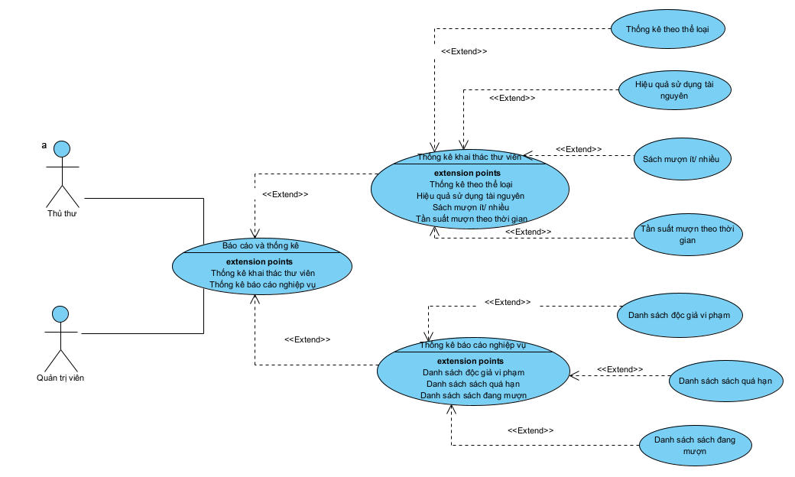

### 3.1.5 Biểu đồ use case mượn sách

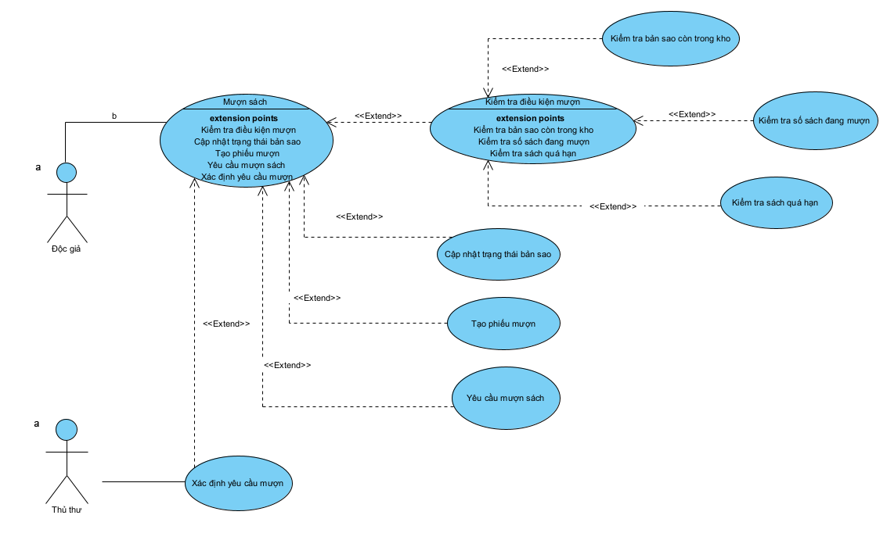

### 3.1.6 Biểu đồ use case phân quyền hệ thống

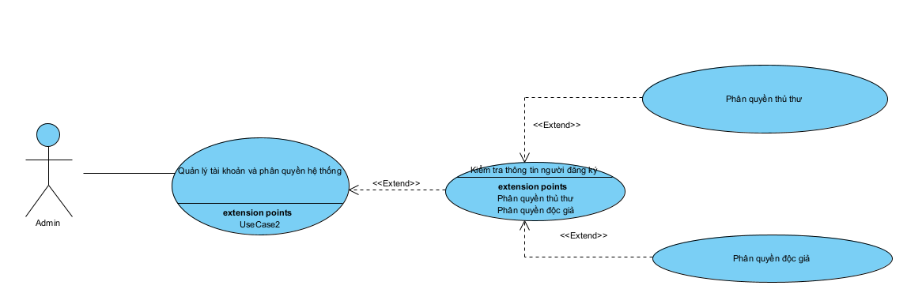

### 3.1.7 Biểu đồ use case quản lý bản sao sách

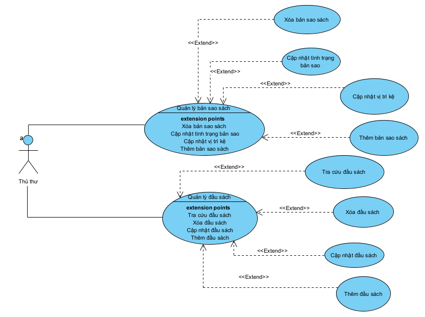

### 3.1.8 Biểu đồ use case gia hạn mượn sách

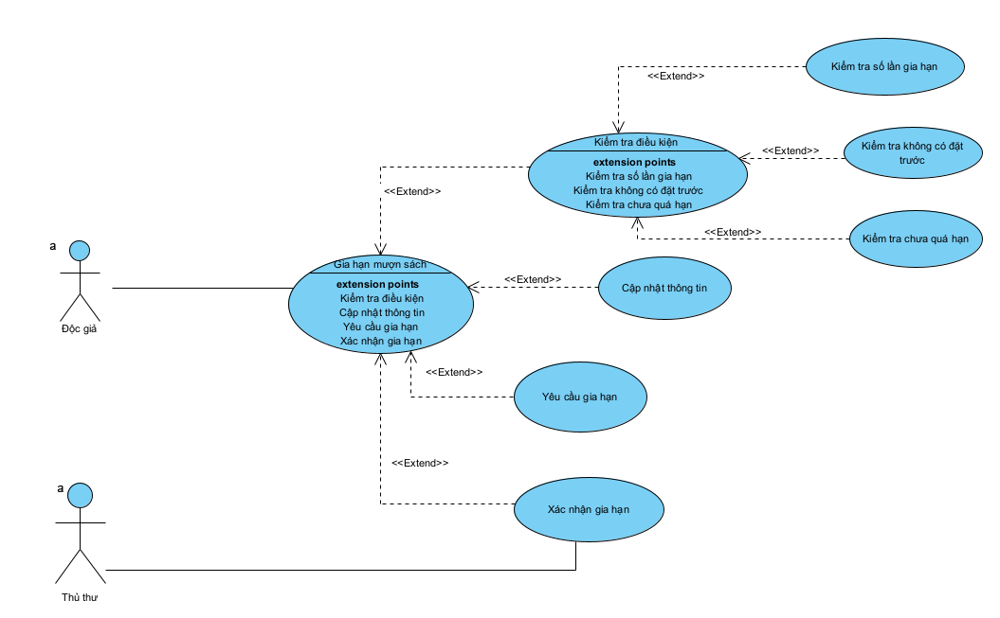

## 3.2 Vai trò của các Actor

### 3.2.1 Vai trò của độc giả

| Thuộc tính                | Mô tả                                                                                                                                                                                                                                             |
| --------------------------- | --------------------------------------------------------------------------------------------------------------------------------------------------------------------------------------------------------------------------------------------------- |
| Tên actor                  | Độc giả                                                                                                                                                                                                                                          |
| Mô tả                     | Độc giả xây dựng hệ thống tra sách, theo dõi việc mượn/trả và thực hiện các yêu cầu dịch vụ như đặt trước hoặc xin gia hạn. Độc giả tương tác thông qua giao diện hệ thống  sau khi đăng nhập.  |
| Mục tiêu                  | Giúp độc giả tìm được sách cần đọc, sử dụng dịch vụ thư viện thuận tiện, quản lý việc  mượn sách và tránh vi phạm quá hạn.                                                                                      |
| Vai trò                    | Người sử dụng dịch vụ thư viện trên hệ thống; chủ động tra cứu, gửi yêu cầu đặt trước/gia hạn và theo dõi lịch sử mượn.                                                                                           |
| Trách nhiệm               | - Đăng nhập hệ thống để sử dụng chức năng cá nhân - Tra cứu thông tin sách - Đặt trước sách khi sách không sẵn có - Gửi yêu cầu gia hạn mượn - Xem danh sách đang mượn và lịch sử mượn |
| Yêu cầu đối với actor: | Có tài khoản hợp lệ; cung cấp thông tin cá nhân chính xác; tuân thủ quy định  mượn–trả và thời hạn mượn của thư viện.                                                                                               |
| Use case tương ứng       | - Đăng nhập - Tra cứu thông tin sách - Đặt trước sách - Yêu cầu gia hạn thời gian mượn Xem danh sách mượn/lịch sử mượn                                                                                  |

### 3.2.2 vai trò của Thủ Thư

| Thuộc tính          | Mô tả                                                                                                                                                                                                                                                                                                                                                                                                           |
| --------------------- | ----------------------------------------------------------------------------------------------------------------------------------------------------------------------------------------------------------------------------------------------------------------------------------------------------------------------------------------------------------------------------------------------------------------- |
| Tên actor            | Thủ thư                                                                                                                                                                                                                                                                                                                                                                                                         |
| Mô tả               | Thủ thư vận hành các nghiệp vụ chính của thư viện: quản lý sách, quản lý độc giả,  xử lý mượn–trả,gia hạn, đặt trước và thu tiền phạt. Thủ thư cập nhật dữ liệu để  đảm bảo hoạt động thư viện chính xác.                                                                                                                                           |
| Mục tiêu            | Đảm bảo quy trình mượn–trả diễn ra đúng quy định, dữ liệu sách/độc giả luôn cập nhật, hỗ trợ quản lý vận hành và báo cáo.                                                                                                                                                                                                                                                     |
| Vai trò              | Nhân viên nghiệp vụ trực tiếp xử lý giao dịch mượn–trả và quản trị dữ liệu hoạt động hằng ngày của thư viện.                                                                                                                                                                                                                                                                       |
| Trách nhiệm         | - Đăng nhập hệ thống để thao tác nghiệp vụ - Quản lý đầu sách và cập nhật thông tin sách - Quản lý bản sao (Mã vạch, tình trạng) - Quản lý đọc giả (thêm/sửa/khóa thẻ) - Lập phiếu mượn, xử lý trả sách - Tính và thu tiền phạt khi quá hạn - Xử lý đặt trước, duyệt gia hạn mượn - Thống kê và lập báo cáo |
| Yêu cầu với actor  | Có tài khoản thủ thư và quyền thao tác; nhập liệu chính xác; tuân thủ quy trình  nghiệp vụ và quy định thư viện.                                                                                                                                                                                                                                                                       |
| Use case tương ứng | - Đăng nhập - Quản lý đầu sách - Quản lý bản sao (gán mã vạch, tình trạng) - Quản lý độc giả (thêm/sửa/khóa thẻ) - Lập phiếu mượn - Trả sách - Tính và thu tiền phạt (xử lý quá hạn) - Xử lý đặt trước - Gia hạn mượn - Thống kê báo cáo                                                                         |

### 3.2.3 Vai trò của Admin hệ thống

| Thuộc tính               | Mô tả                                                                                                                                                                                                                                                                   |
| -------------------------- | ------------------------------------------------------------------------------------------------------------------------------------------------------------------------------------------------------------------------------------------------------------------------- |
| Tên actor                 | Admin hê thống                                                                                                                                                                                                                                                          |
| Mô tả                    | Admin chịu trách nhiệm quản trị hệ thống: quản lý tài khoản người dùng và phân quyền,  cấu hình các quy định vận hành áp dụng chung cho toàn hệ thống thư viện.                                                                       |
| Mục tiêu                 | Đảm bảo hệ thống hoạt động ổn định, an toàn; quyền truy cập đúng vai trò; các quy định được cấu hình thống nhất và dễ quản lý                                                                                                         |
| Vai trò                   | Quản trị viên hệ thống, kiểm soát quyền truy cập và thiết lập cấu hình/quy định hệ thống.                                                                                                                                                               |
| Trách nhiệm              | - Đăng nhập hệ thống với quyền quản trị - Quản lý tài khoản và phân quyền hệ thống - Cấu hính quy định (Thời gian mượn, mức phạt, giới hạn mượn...) - Theo dõi và đảm bảo tính nhất quán dữ liệu theo quy định |
| Yêu cầu đối với actor | Có tài khoản admin; hiểu cấu trúc quyền và quy định thư viện; cấu hình đúng để không  ảnh hưởng vận hành.                                                                                                                                    |
| Use case tương ứng      | - Đăng nhập - Quản lý tài khoản và phân quyền hệ thống - Cấu hình quy định                                                                                                                                                                      |

## 3.3 kịch bản hoạt động use case

### 3.3.1 Use case đăng ký

| Mục               | Nội dung                                                                                                                                                                                                                                                                                                                                                                                                                                                                                                                                                                                                                                                                               |
| ------------------ | --------------------------------------------------------------------------------------------------------------------------------------------------------------------------------------------------------------------------------------------------------------------------------------------------------------------------------------------------------------------------------------------------------------------------------------------------------------------------------------------------------------------------------------------------------------------------------------------------------------------------------------------------------------------------------------- |
| Tên Use case      | Đăng ký                                                                                                                                                                                                                                                                                                                                                                                                                                                                                                                                                                                                                                                                              |
| Actor chính       | Độc giả                                                                                                                                                                                                                                                                                                                                                                                                                                                                                                                                                                                                                                                                              |
| Mô tả            | Use case cho phép người dùng mới (độc giả) tạo tài khoản để sử dụng các dịch vụ của hệ thống quản lý thư viện  như tra cứu sách, mượn sách, đặt trước và gia hạn mượn.                                                                                                                                                                                                                                                                                                                                                                                                                                                                      |
| Tiền điều kiện | - Cung cấp thông tin xác thực                                                                                                                                                                                                                                                                                                                                                                                                                                                                                                                                                                                                                                                       |
| Hậu điều kiện  | - Tài khoản độc giả được tạo thành công và lưu trong cơ sở dữ liệu - Người dùng cố thể đăng nhập để sử dụng hệ thống                                                                                                                                                                                                                                                                                                                                                                                                                                                                                                                               |
| Luông chính      | - Người dùng truy cập website hệ thống thư viện - Chọn chức năng đăng ký - Hệ thống hiển thị form đăng ký tài khoản -Người dùng nhập đầy đủ thông tin cá nhân (họ tên, email, số điện thoại,mật khẩu, địa chỉ...) - Người dùng xác nhận đăng ký - Hệ thống kiểm tra tính hợp lệ của thông tin (định dạng email, độ mạnh mật khẩu, dữ liệu bắt buộc) - Hệ hống kiểm tra email/số điện thoại có tồn tại trong hệ thống hay không - Hệ thống lưu trữ thông tin tài khoản vào co sở dũ liệu -Hệ thống thông báo đăng ký thành công |
| Luồng phụ        | - Nếu thông tin không hợp lệ: Hệ thống hiển thị thông báo lỗi và yêu cầu người dùng nhập lại - Email hoặc số điện thoại đã tồn tại: Hệ thống thông báo tài khoản đã tồn tại, yêu cầu sử dụng thông tin khác - Người dùng nhập thiếu thông tin :Hệ thống yêu cầu bổ sung thông tin bắt bu                                                                                                                                                                                                                                                                                                                          |
| Kết quả          | Tài khoản độc giả được tạo thành công                                                                                                                                                                                                                                                                                                                                                                                                                                                                                                                                                                                                                                        |

### 3.3.2 Use case đăng nhập

**Bảng: Quy trình đăng nhập**

| Mục               | Nội dung                                                                                                                                                                                                                                                                 |
| ------------------ | ------------------------------------------------------------------------------------------------------------------------------------------------------------------------------------------------------------------------------------------------------------------------- |
| Tên Use case      | Đăng nhập                                                                                                                                                                                                                                                              |
| Mô tả            | Cho phép người dùng truy cập hệ thống thư viện theo quyền được cấp                                                                                                                                                                                          |
| Actor chính       | Độc giả/ thủ thư/ admin                                                                                                                                                                                                                                              |
| Tiền điều kiện | - Người dùng đã có tài khoản hợp lệ trong hệ thống                                                                                                                                                                                                            |
| Hậu điều kiện  | - Người dùng được xác thực và truy cập vào giao diện tương ứng với vai trò                                                                                                                                                                               |
| Luồng chính      | - Người dùng truy cập hệ thống và chọn chức năng đăng nhập - Nhập tên đăng nhập và mật khẩu - Hệ thống kiểm tra thống tin xác thực - Nếu hợp lệ, hệ thống cho phép truy cập các chức năng tương ứng với vai trò |
| Luồng phụ        | - Nếu tên đnăg nhập hoặc sai mật, hệ thống thông báo lỗi - Người dùng nhập lại thông tin đăng nhập                                                                                                                                              |
| Kết quả          | -  Người dùng đăng nhập thành công  và sử dụng hệ thống theo quyền được cấp                                                                                                                                                                           |

### 3.3.3 Use case tra cứu thông tin sách

**Bảng: Quy trình tra cứu thông tin sách**

| Mục               | Nội dung                                                                                                                                                                                                                                                                                 |
| ------------------ | ----------------------------------------------------------------------------------------------------------------------------------------------------------------------------------------------------------------------------------------------------------------------------------------- |
| Tên Use case      | Tra cứu thông tin sách                                                                                                                                                                                                                                                                 |
| Actor chính       | Độc giả                                                                                                                                                                                                                                                                                |
| Mô tả            | Cho phép độc giả tìm kiếm sách và xem thông tin chi tiết, tình trạng sách.                                                                                                                                                                                                   |
| Tiền điều kiện | - Độc giả đã đăng nhập vào hệ thống                                                                                                                                                                                                                                           |
| Hậu điều kiện  | - Danh sách/chi tiết sách được hiển thị cho độc giả.                                                                                                                                                                                                                          |
| Luông chính      | -  Độc giả đã đăng nhập vào hệ thống -  Nhập từ khóa tìm kiếm (tên sách / tên tác giả / thể loại) -Hệ thống tìm kiếm và trả về danh sách phù hợp - Độc giả chọn sách để xem chi tiết (Mô tả, số lượng, tình trạng ...) |
| Luồng phụ        | - Nếu không có kết quả => hệ thống thông báo không tìm thấy sách                                                                                                                                                                                                             |
| Kết quả          | Độc giả xem được thông tin và tình trạng sách cần tìm                                                                                                                                                                                                                        |

### 3.3.4 Xem danh sách mượn/ lịch sử mượn

**Bảng: quy trình xem danh sách mượn/ lịch sử mượn**

| Mục               | Nội dung                                                                                                                                                                                                                                   |
| ------------------ | ------------------------------------------------------------------------------------------------------------------------------------------------------------------------------------------------------------------------------------------- |
| Tên Use case      | Xem danh sách mượn / lịch sử mượn                                                                                                                                                                                                    |
| Actor chính       | Độc giả                                                                                                                                                                                                                                  |
| Mô tả            | Cho phép độc giả theo dõi sách đang mượn và các lần mượn trước đây.                                                                                                                                                       |
| Tiền điều kiện | - Độc giả đã đăng nhập vào hệ thống                                                                                                                                                                                             |
| Hậu điều kiện  | - Thông tin mượn sách được hiển thị đầy đủ                                                                                                                                                                                    |
| Luồng chính      | - Độc giả chọn chức năng xem danh sách mượn/ lịch sử mượn - Hệ thống tải dữ liệu mượn, tạo và xem lịch xử mượn - Hệ thống hiển thị danh sách (Tên sách, ngày mượn, hạn trả, trạng thái..) |
| Luồng phụ        | - Nếu chưa từng mượn sách → hiển thị danh sách trống và thông báo phù hợp                                                                                                                                                 |
| Kết quả          | Độc giả xem được tình trạng mượn và lịch sử mượn của mình                                                                                                                                                                  |

### 3.3.5 Đặt trước sách

**Bảng: quy trình đặt trước sách**

| Mục               | Nội dung                                                                                                                                                                                                                                                               |
| ------------------ | ----------------------------------------------------------------------------------------------------------------------------------------------------------------------------------------------------------------------------------------------------------------------- |
| Tên Use case      | Đặt trước sách                                                                                                                                                                                                                                                     |
| Actor chính       | Độc giả                                                                                                                                                                                                                                                              |
| Mô tả            | Cho phép độc giả đặt trước khi sách đang được mượn/không sẵn có.                                                                                                                                                                                      |
| Tiền điều kiện | - Độc giả đã đăng nhập vào hệ thống, sách ở trạng thái không sẵn có để mượn ngay.                                                                                                                                                            |
| Hậu điều kiện  | -Yêu cầu đặt trước được lưu và xếp hàng chờ.                                                                                                                                                                                                              |
| Luồng chính      | - Độc giả chọn sách muốn đặt trước - Chọn chức năng đặt trước -  Hệ thống kiểm tra điều kiện đặt trước (tình trạng sách, giới hạn đặt...) - Hệ thống ghi nhận yêu cầu và thông báo đặt trước thành công |
| Luồng phụ        | -  Nếu sách còn sẵn  => Hệ thống không cho đặt trước mà gợi ý mượn trực tiếp - Nếu độc giả đã đặt trước sách => Hệ thống thông báo yêu cầu đã tồn tại                                                                     |
| Kết quả          | Độc giả đặt trước thành công và chờ đến lượt nhận sách                                                                                                                                                                                                 |

### 3.3.6 Yêu cầu gia hạn mượn sách

**Bảng: Quy trình gia hạn mượn sách**

| Mục               | nội dung                                                                                                                                                                                                                                       |
| ------------------ | ----------------------------------------------------------------------------------------------------------------------------------------------------------------------------------------------------------------------------------------------- |
| Tên Use case      | Yêu cầu gia hạn thời gian mượn                                                                                                                                                                                                            |
| Actor chính       | Độc giả                                                                                                                                                                                                                                      |
| Mô tả            | Cho phép độc giả gửi yêu cầu gia hạn sách đang mượn                                                                                                                                                                                 |
| Tiền điều kiện | - Độc giả đã đăng nhập vào hệ thống, đang có sách mượn; chưa quá hạn (tùy quy định).                                                                                                                                    |
| Hậu điều kiện  | - Yêu cầu gia hạn được tạo và gửi đến thủ thư xử lý                                                                                                                                                                              |
| Luồng chính      | - Độc giả truy cập vào danh sách đang mượn - Chọn sách cần gia hạn và chọn "Yêu cầu gia hạn" - Hệ thống kiểm tra điều kiện gia hạn - Hệ thống ghi nhận yêu cầu và thông báo đã gửi yêu cầu |
| Luồng phụ        | - Nếu sách có người đặt trước => Hệ thống từ chối gia hạn - Nếu vượt số lần gia hạn tối đa => Hệ thống từ chối và thông báo lý do                                                                            |
| Kết quả          | Yêu cầu gia hạn được gửi thành công để chờ duyệt                                                                                                                                                                                   |

### 3.3.7 xử lý gia hạn mượn (Thủ thư)

**Bảng: Quy trình xử lý yêu cầu gia hạn**

| Mục               | Nội dung                                                                                                                                                                                                                                                                           |
| ------------------ | ----------------------------------------------------------------------------------------------------------------------------------------------------------------------------------------------------------------------------------------------------------------------------------- |
| Tên Use case      | Gia hạn mượn                                                                                                                                                                                                                                                                     |
| Actor chính       | Thủ thư                                                                                                                                                                                                                                                                           |
| Mô tả            | Thủ thư duyệt hoặc từ chối yêu cầu gia hạn của độc giả.                                                                                                                                                                                                                |
| Tiền điều kiện | - Thủ thư đã đăng nhập; tồn tại yêu cầu gia hạn hợp lệ.                                                                                                                                                                                                               |
| Hậu điều kiện  | - Hạn trả được cập nhật hoặc yêu cầu bị từ chối và ghi nhận lý do                                                                                                                                                                                                  |
| Luông chính      | - Thủ thư mở danh sách yêu cầu gia hạn - Chọn một yêu cầu cần xử lý - Hệ thống hiển thị thông tin mượn và điều kiện liên quan - Thủ thư chọn “Duyệt” - Hệ thống cập nhật hạn trả mới và thông báo cho độc giả |
| Luồng phụ        | - Thủ thư chọn “Từ chối” => hệ thống ghi nhận lý do và thông báo cho độc giả                                                                                                                                                                                      |
| Kết quả          | Yêu cầu gia hạn được xử lý xong (duyệt hoặc từ chối)                                                                                                                                                                                                                    |

### 3.3.8 Lập phiếu mượn

**Bảng: quy trình xử lý lập phiếu mượn**

| Mục               | Nội dung                                                                                                                                                                                                                                                                                                                                                            |
| ------------------ | -------------------------------------------------------------------------------------------------------------------------------------------------------------------------------------------------------------------------------------------------------------------------------------------------------------------------------------------------------------------- |
| Tên Use case      | Lập phiếu mượn                                                                                                                                                                                                                                                                                                                                                   |
| Actor chính       | Thủ thư                                                                                                                                                                                                                                                                                                                                                            |
| Mô tả            | Ghi nhận giao dịch cho độc giả mượn sách và cập nhật trạng thái sách.                                                                                                                                                                                                                                                                                  |
| Tiền điều kiện | - Thủ thư đã đăng nhập; thẻ độc giả hợp lệ; sách còn sẵn.                                                                                                                                                                                                                                                                                           |
| Hậu điều kiện  | - Phiếu mượn được tạo; sách chuyển trạng thái “Đang mượn”.                                                                                                                                                                                                                                                                                          |
| Luông chính      | - Thủ thư chọn chức năng lập phiếu mượn - Nhập/ quét mã thẻ độc giả - Quét/ chọn bản sao cần mượn - Hệ thống kiểm tra điều kiện mượn (giới hạn số lượng, nợ phạt...) - Hệ thống tạo phiếu mượn và thiết lập hạn trả - Hệ thống cập nhật trạng thái bản sao sang "Đang mượn" |
| Luồng phụ        | - Nếu thẻ bị khóa/hết hạn => hệ thống từ chối lập phiếu - Nếu vượt số lượng sách cho phép => hệ thống từ chối - Nếu sách không sẵn → hệ thống từ chối và gợi ý đặt trước                                                                                                                                       |
| Kết quả          | Phiếu mượn được lập thành công và ghi nhận trên hệ thống                                                                                                                                                                                                                                                                                               |

### 3.3.9 Trả sách

**Bảng: Quy trình trả sách**

| Mục               | Nội dung                                                                                                                                                                                                                                                                                     |
| ------------------ | --------------------------------------------------------------------------------------------------------------------------------------------------------------------------------------------------------------------------------------------------------------------------------------------- |
| Tên Use case      | Trả sách                                                                                                                                                                                                                                                                                    |
| Actor chính       | Thủ thư                                                                                                                                                                                                                                                                                     |
| Mô tả            | Xử lý việc độc giả trả sách, cập nhật trạng thái và kiểm tra quá hạn.                                                                                                                                                                                                         |
| Tiền điều kiện | - Thủ thư đã đăng nhập; sách đang ở trạng thái “Đang mượn”.                                                                                                                                                                                                                 |
| Hậu điều kiện  | - Sách chuyển trạng thái “Có sẵn”; nếu quá hạn phát sinh xử lý phạt.                                                                                                                                                                                                          |
| Luông chính      | - Thủ thư chọn chức năng trả sách - Nhập mã vạch bản sao sách trả - Hệ thống tìm phiếu mượn tương ứng - Hệ thống cập nhật trạng thái sách sang "Có sẵn/Đã trả" - Hệ thống kiểm tra hạn trả và số ngày quá hạn (nếu có) |
| Luồng phụ        | - Nếu không tìm thấy phiếu mượn => thông báo lỗi (sai mã vạch/không tồn tại) - Nếu quá hạn => hệ thống chuyển sang use case "Tính và thu tiền phạt "                                                                                                           |
| Kết quả          | Trả sách thành công; dữ liệu mượn–trả được cập nhật                                                                                                                                                                                                                            |

### 3.3.10 Tính và thu tiền phạt (Xử lý quá hạn)

**Bảng: Quy trình xử lý quá hạn**

| Mục               | Nội dung                                                                                                                                                                                                                                                                                                                    |
| ------------------ | ---------------------------------------------------------------------------------------------------------------------------------------------------------------------------------------------------------------------------------------------------------------------------------------------------------------------------- |
| Tên Use case      | Tính và thu tiền phạt                                                                                                                                                                                                                                                                                                    |
| Actor chính       | Thủ thư                                                                                                                                                                                                                                                                                                                    |
| Mô tả            | Tính tiền phạt khi độc giả trả sách trễ hạn và ghi nhận thanh toán.                                                                                                                                                                                                                                             |
| Tiền điều kiện | - Có giao dịch trả sách quá hạn hoặc độc giả đang có khoản phạt.                                                                                                                                                                                                                                              |
| Hậu điều kiện  | - Khoản phạt được thanh toán/ghi nhận, cập nhật vào hồ sơ độc giả.                                                                                                                                                                                                                                           |
| Luông chính      | - Hệ thống xác định số ngày quá hạn dựa trên hạn trả - Tính tiền phạt theo quy định (mức phạt/ngày) - Hiển thị số tiền phạt cho thủ thư và độc giả - Thủ thư xác nhận đã thu tiền - Hệ thống lưu thông tin thanh toán và cập nhật trạng thái phạt |
| Luồng phụ        | - Nếu độc giả chưa thanh toán => hệ thống ghi nhận còn nợ và có thể hạn chế mượn tiếp                                                                                                                                                                                                                    |
| Kết quả          | Tiền phạt được xử lý và lưu vào hệ thống                                                                                                                                                                                                                                                                         |

### 3.3.11 Xử lý đặt trước

**Bảng: Quy trình xử lý đặt trước**

| Mục               | Nội dung                                                                                                                                                                                                                                                                                                    |
| ------------------ | ------------------------------------------------------------------------------------------------------------------------------------------------------------------------------------------------------------------------------------------------------------------------------------------------------------ |
| Tên Use case      | Xử lý đặt trước                                                                                                                                                                                                                                                                                        |
| Actor chính       | Thủ thư                                                                                                                                                                                                                                                                                                    |
| Mô tả            | Quản lý danh sách đặt trước và ưu tiên cấp sách cho người đặt trước khi sách sẵn có.                                                                                                                                                                                                   |
| Tiền điều kiện | - Thủ thư đã đăng nhập vào hệ thống; tồn tại yêu cầu đặt trước.                                                                                                                                                                                                                           |
| Hậu điều kiện  | - Yêu cầu được cập nhật trạng thái (đã sẵn sàng/đã hủy/đã xử lý).                                                                                                                                                                                                                       |
| Luồng chính      | - Thủ thư xem danh sách yêu cầu đặt trước - Khi sách được trả, hệ thống xác định người đặt trước theo thứ tự - Thủ thư xác nhận giữ sách cho độc giả đặt trước - Hệ thống cập nhật trạng thái yêu cầu và gửi thông báo cho độc giả |
| Luồng phụ        | - Nếu độc giả không đến nhận trong thời hạn quy định => hủy đặt trước và chuyển người tiếp theo                                                                                                                                                                                  |
| Kết quả          | Đặt trước được xử lý, đảm bảo ưu tiên đúng người chờ                                                                                                                                                                                                                                      |

### 3.3.12 Quản lý đầu sách

\*\*Bảng : Quy trình quản lý đầu sách

| Mục               | Nội dung                                                                                                                                                                                                |
| ------------------ | -------------------------------------------------------------------------------------------------------------------------------------------------------------------------------------------------------- |
| Tên Use case      | Quản lý đầu sách                                                                                                                                                                                    |
| Actor chính       | Thủ thư                                                                                                                                                                                                |
| Mô tả            | Thêm/sửa/xóa thông tin đầu sách (tên, tác giả, thể loại, NXB…).                                                                                                                             |
| Tiền điều kiện | - Thủ thư đã đăng nhập vào hệ thống                                                                                                                                                           |
| Hậu điều kiện  | - Thông tin đầu sách được cập nhật vào hệ thống.                                                                                                                                            |
| Luồng chính      | - Thủ thư chọn chức năng quản lý đầu sách - Chọn thao tác thêm/sửa/xóa - Nhập/chỉnh sửa thông tin đầu sách - Hệ thống kiểm tra dữ liệu và lưu thay đổi |
| Luồng phụ        | - Nếu thiếu dữ liệu bắt buộc => yêu cầu nhập lại - Nếu xóa đầu sách còn bản sao đang mượn => hệ thống từ chối xóa                                                        |
| Kết quả          | Danh mục đầu sách được cập nhật chính xác                                                                                                                                                     |

### 3.3.13 Quản lý bản sao

**Bảng: Quy trình xử lý bản sao**

| Mục               | Nội dung                                                                                                                                                                                                                                               |
| ------------------ | ------------------------------------------------------------------------------------------------------------------------------------------------------------------------------------------------------------------------------------------------------- |
| Tên Use case      | Quản lý bản sao sách                                                                                                                                                                                                                                |
| Actor chính       | Thủ thư                                                                                                                                                                                                                                               |
| Mô tả            | Quản lý từng bản sao vật lý của sách: gán mã vạch và cập nhật tình trạng                                                                                                                                                                |
| Tiền điều kiện | - Thủ thư đã đăng nhập vào hệ thống; đầu sách đã tồn tại.                                                                                                                                                                             |
| Hậu điều kiện  | - Bản sao được tạo/cập nhật trạng thái trong hệ thống.                                                                                                                                                                                      |
| Luồng chính      | - Thủ thư chọn chức năng quản lý bản sao -  Chọn đầu sách liên quan - Thêm bản sao mói và gán mã vạch - Cập nhật tình trạng (có sẵn/đang mượn/hư hỏng/mất) - Hệ thống lưu thông tin bản sao |
| Luồng phụ        | - Nếu mã vạch trùng → hệ thống yêu cầu nhập mã khá                                                                                                                                                                                         |
| Kết quả          | Bản sao sách được theo dõi chính xác và đồng bộ trạng thái                                                                                                                                                                                |

### 3.3.14 Quản lý độc giả

**Bảng : Quy trình quản lý độc giả**

| Mục               | Nội dung                                                                                                                                                                                            |
| ------------------ | ---------------------------------------------------------------------------------------------------------------------------------------------------------------------------------------------------- |
| Tên Use case      | Quản lý độc giả                                                                                                                                                                                 |
| Actor chính       | Thủ thư                                                                                                                                                                                            |
| Mô tả            | Quản lý thông tin độc giả và trạng thái thẻ thư viện.                                                                                                                                    |
| Tiền điều kiện | - Thủ thư đã đăng nhập vào hệ thống.                                                                                                                                                      |
| Hậu điều kiện  | - Hồ sơ độc giả được cập nhật, thẻ có thể bị khóa/mở theo quy định..                                                                                                              |
| Luồng chính      | - Thủ thư chọn chức năng quản lý độc giả  - Thêm mới hoặc cập nhật thông tin độc giả - Nếu cần, thủ thư khóa thẻ độc giả - Hệ thống lưu thay đổi |
| Luồng phụ        | - Nếu email/sđt trùng => hệ thống báo lỗi và yêu cầu chỉnh sửa                                                                                                                          |
| Kết quả          | Thông tin độc giả được quản lý tập trung và chính xác                                                                                                                                   |

### 3.3.15 Thống kê báo cáo

**Bảng: Quy trình thống kê báo cáo**

| Mục               | Nội dung                                                                                                                                                                                                             |
| ------------------ | --------------------------------------------------------------------------------------------------------------------------------------------------------------------------------------------------------------------- |
| Tên Use case      | Thống kê báo cáo                                                                                                                                                                                                  |
| Actor chính       | Thủ thư                                                                                                                                                                                                             |
| Mô tả            | Tổng hợp dữ liệu phục vụ quản lý thư viện (mượn nhiều, quá hạn, tồn kho…).                                                                                                                          |
| Tiền điều kiện | - Thủ thư đã đăng nhập vào hệ thống                                                                                                                                                                        |
| Hậu điều kiện  | - Báo cáo được tạo và hiển thị/xuất ra file.                                                                                                                                                               |
| Luồng chính      | - Thủ thư chọn chức năng thống kê báo cáo - Chọn loại báo cáo và khoảng thời gian - Hệ thống tổng hợp dữ liệu và hiển thị kết quả - Thủ thư xem hoặc xuất báo cáo |
| Luồng phụ        | - Nếu không có dữ liệu trong khoảng thời gian → báo cáo rỗng và thông báo phù hợp                                                                                                                   |
| Kết quả          | Báo cáo được tạo thành công phục vụ quản lý                                                                                                                                                               |

### 3.3.16 Quản lý tài khoản và phân quyền hệ thống

**Bảng: Quy trình quản lý tài khoản và phân quyền hệ thống**

| Mục               | Nội dung                                                                                                                                                                                                                          |
| ------------------ | ---------------------------------------------------------------------------------------------------------------------------------------------------------------------------------------------------------------------------------- |
| Tên Use case      | Quản lý tài khoản và phân quyền hệ thống                                                                                                                                                                                  |
| Actor chính       | Admin                                                                                                                                                                                                                              |
| Mô tả            | Quản lý tài khoản người dùng hệ thống và phân quyền truy cập chức năng.                                                                                                                                             |
| Tiền điều kiện | - Admin đã đăng nhập bằng tài khoản quản trị                                                                                                                                                                            |
| Hậu điều kiện  | - Tài khoản/quyền được cập nhật và có hiệu lực.                                                                                                                                                                       |
| Luồng chính      | - Admin chọn chức năng quản lý tài khoản và phân quyền hệ thống - Tạo mới/sửa/xóa/kháo tài khoản người dùng - Gán vai trò và quyền truy cập chức năng - Hệ thống lưu thay đổi |
| Luồng phụ        | - Nếu tài khoản trùng tên đăng nhập => hệ thống báo lỗi - Nếu xóa tài khoản đang hoạt động nghiệp vụ => hệ thống yêu cầu khó thay vì xóa                                                        |
| Kết quả          | Tài khoản và quyền truy cập được quản lý chặt chẽ, đúng vai trò                                                                                                                                                     |

### 3.3.17 Cấu hình quy định

**Bảng: Quy trình cài đặt cấu hình hệ thống**

| Mục               | Nội dung                                                                                                                                                                                                                                                                        |
| ------------------ | -------------------------------------------------------------------------------------------------------------------------------------------------------------------------------------------------------------------------------------------------------------------------------- |
| Tên Use case      | Cấu hình quy định                                                                                                                                                                                                                                                            |
| Actor chính       | Admin                                                                                                                                                                                                                                                                            |
| Mô tả            | Thiết lập các quy định chung: số ngày mượn, mức phạt, số sách tối đa…                                                                                                                                                                                            |
| Tiền điều kiện | - Admin đã đăng nhập bằng tài khoản quản trị                                                                                                                                                                                                                          |
| Hậu điều kiện  | - Quy định mới được lưu và áp dụng toàn hệ thống.                                                                                                                                                                                                                  |
| Luồng chính      | - Admin mở chức năng cấu hình quy định - Nhập/điều chỉnh tham số quy định - Hệ thống kiểm tra hợp lệ (giá trị số, giới hạn...) - Admin xác nhận lưu định dạng cấu hình - Hệ thống cập nhật và áp dụng quy định |
| Luồng phụ        | -Nếu tham số không hợp lệ => hệ thống báo lỗi và yêu cầu nhập lại                                                                                                                                                                                                  |
| Kết quả          | Quy định thư viện được cập nhật và áp dụng thống nhất                                                                                                                                                                                                              |

# CHƯƠNG 4. ĐẶC TẢ USE CASE HỆ THỐNG QUẢN LÝ THƯ VIỆN

---

## 4.0. Sơ đồ tổng quát hệ thống (Use Case Diagram)

Sơ đồ Use Case tổng quát mô tả toàn bộ các chức năng chính của hệ thống Quản lý Thư viện và mối quan hệ tương tác giữa các Actor và hệ thống. Sơ đồ này giúp xác định phạm vi chức năng, tránh thiếu hoặc trùng lặp yêu cầu trong quá trình phân tích.

### Các Actor trong hệ thống

| Actor            | Mô tả quyền hạn                                                                                    |
| ---------------- | ------------------------------------------------------------------------------------------------------ |
| Bạn đọc       | Tìm kiếm sách, mượn sách, trả sách, gia hạn mượn, đặt trước sách, xem lịch sử mượn |
| Thủ thư        | Quản lý sách, quản lý mượn – trả, quản lý thông tin bạn đọc                             |
| Quản trị viên | Quản lý tài khoản nhân viên, cấu hình hệ thống, báo cáo – thống kê, sao lưu dữ liệu  |

Sơ đồ Use Case tổng quát là cơ sở để xây dựng các sơ đồ chi tiết như **Sequence Diagram** và **Activity Diagram** cho từng chức năng cụ thể.

---

## 4.2. ĐẶC TẢ USE CASE: ĐĂNG NHẬP

### Thông tin chung

| Thuộc tính        | Nội dung                                                                 |
| ------------------- | ------------------------------------------------------------------------- |
| Tên Use Case       | Đăng nhập                                                              |
| Mô tả             | Cho phép người dùng truy cập vào hệ thống theo đúng quyền hạn |
| Actor chính        | Bạn đọc, Thủ thư, Quản trị viên                                   |
| Actor phụ          | Hệ thống xác thực                                                     |
| Mục tiêu          | Xác thực người dùng và phân quyền truy cập                       |
| Mức độ ưu tiên | Cao                                                                       |

### Điều kiện

| Loại              | Mô tả                                                                      |
| ------------------ | ---------------------------------------------------------------------------- |
| Tiền điều kiện | Người dùng đã có tài khoản hợp lệ và chưa đăng nhập           |
| Hậu điều kiện  | Người dùng được đăng nhập thành công hoặc nhận thông báo lỗi |

### Luồng sự kiện chính

1. Người dùng truy cập trang đăng nhập.
2. Người dùng nhập **username** và  **password** .
3. Người dùng nhấn nút  **Đăng nhập** .
4. Hệ thống kiểm tra tính hợp lệ của thông tin.
5. Hệ thống xác định quyền người dùng.
6. Chuyển đến giao diện chức năng tương ứng.

### Luồng sự kiện phụ / Ngoại lệ

* **A1: Sai thông tin đăng nhập**
  1. Username hoặc password không đúng.
  2. Hệ thống hiển thị thông báo lỗi.
* **A2: Tài khoản bị khóa**
  1. Hệ thống thông báo tài khoản không khả dụng.

### Quy tắc nghiệp vụ

* Mật khẩu phải được mã hóa trong CSDL.
* Một tài khoản đăng nhập không quá 5 lần sai liên tiếp.

### Dữ liệu vào/ra

* Dữ liệu vào: username, password
* Dữ liệu ra: thông tin người dùng, quyền hạn

---

## 4.3. ĐẶC TẢ USE CASE: QUẢN LÝ SÁCH

### Thông tin chung

| Thuộc tính        | Nội dung                                   |
| ------------------- | ------------------------------------------- |
| Tên Use Case       | Quản lý sách                             |
| Mô tả             | Quản lý thông tin sách trong thư viện |
| Actor chính        | Thủ thư, Quản trị viên                 |
| Mục tiêu          | Cập nhật danh mục sách chính xác      |
| Mức độ ưu tiên | Cao                                         |

### Điều kiện

| Loại              | Mô tả                                               |
| ------------------ | ----------------------------------------------------- |
| Tiền điều kiện | Người dùng đã đăng nhập với quyền quản lý |
| Hậu điều kiện  | Thông tin sách được thêm/sửa/xóa trong CSDL   |

### Luồng sự kiện chính

1. Thủ thư chọn chức năng  **Quản lý sách** .
2. Chọn thao tác: Thêm / Sửa / Xóa sách.
3. Nhập hoặc chỉnh sửa thông tin sách (mã sách, tên sách, tác giả, NXB, số lượng…).
4. Hệ thống kiểm tra dữ liệu.
5. Lưu thông tin vào hệ thống.

### Luồng sự kiện phụ

* **B1: Dữ liệu không hợp lệ**
  1. Thiếu thông tin hoặc trùng mã sách.
  2. Hệ thống thông báo lỗi và yêu cầu nhập lại.

### Quy tắc nghiệp vụ

* Mã sách là duy nhất.
* Không được xóa sách đang được mượn.

---

## 4.4. ĐẶC TẢ USE CASE: MƯỢN SÁCH

### Thông tin chung

| Thuộc tính        | Nội dung                    |
| ------------------- | ---------------------------- |
| Tên Use Case       | Mượn sách                 |
| Actor chính        | Bạn đọc, Thủ thư        |
| Mục tiêu          | Ghi nhận việc mượn sách |
| Mức độ ưu tiên | Cao                          |

### Điều kiện

| Loại              | Mô tả                                                                      |
| ------------------ | ---------------------------------------------------------------------------- |
| Tiền điều kiện | Bạn đọc đã đăng nhập và còn quyền mượn sách                    |
| Hậu điều kiện  | Phiếu mượn được tạo, sách chuyển sang trạng thái “Đang mượn” |

### Luồng sự kiện chính

1. Bạn đọc chọn sách cần mượn.
2. Gửi yêu cầu mượn sách.
3. Hệ thống kiểm tra số lượng và điều kiện mượn.
4. Lập phiếu mượn.
5. Cập nhật trạng thái sách.

### Luồng sự kiện phụ

* **C1: Sách đã hết** → Thông báo không thể mượn.
* **C2: Vượt quá số sách cho phép** → Từ chối yêu cầu.

### Quy tắc nghiệp vụ

* Mỗi bạn đọc chỉ được mượn tối đa N cuốn.
* Thời hạn mượn là X ngày.

---

## 4.5. ĐẶC TẢ USE CASE: TRẢ SÁCH

### Thông tin chung

| Thuộc tính  | Nội dung                  |
| ------------- | -------------------------- |
| Tên Use Case | Trả sách                 |
| Actor chính  | Bạn đọc, Thủ thư      |
| Mục tiêu    | Ghi nhận việc trả sách |

### Luồng sự kiện chính

1. Người dùng chọn chức năng  **Trả sách** .
2. Nhập mã phiếu mượn.
3. Hệ thống xác nhận thông tin.
4. Cập nhật trạng thái sách.

### Luồng sự kiện phụ

* **D1: Trả sách quá hạn** → Hệ thống tính tiền phạt.

### Quy tắc nghiệp vụ

* Tiền phạt = số ngày trễ × mức phạt/ngày.

---

## 4.6. ĐẶC TẢ USE CASE: TÌM KIẾM SÁCH

### Luồng sự kiện chính

1. Người dùng nhập từ khóa.
2. Chọn tiêu chí (tên sách, tác giả, thể loại…).
3. Hệ thống xử lý.
4. Hiển thị kết quả.

### Luồng sự kiện phụ

* Không có kết quả → Thông báo cho người dùng.

---

## 4.7. ĐẶC TẢ USE CASE: QUẢN LÝ BẠN ĐỌC

### Luồng sự kiện chính

1. Thủ thư chọn chức năng  **Quản lý bạn đọc** .
2. Thêm / Sửa / Xóa thông tin bạn đọc.
3. Hệ thống kiểm tra dữ liệu.
4. Lưu thông tin.

### Quy tắc nghiệp vụ

* Mã bạn đọc là duy nhất.
* Không xóa bạn đọc đang mượn sách.

---

## 4.8. ĐẶC TẢ USE CASE BỔ SUNG (MỞ RỘNG)

### 4.8.1. ĐẶC TẢ USE CASE: GIA HẠN MƯỢN SÁCH

#### Thông tin chung

| Thuộc tính        | Nội dung                                                          |
| ------------------- | ------------------------------------------------------------------ |
| Tên Use Case       | Gia hạn mượn sách                                              |
| Mô tả             | Cho phép bạn đọc gia hạn thời gian mượn sách đang mượn |
| Actor chính        | Bạn đọc, Thủ thư                                              |
| Mục tiêu          | Kéo dài thời gian mượn sách theo quy định                  |
| Mức độ ưu tiên | Trung bình                                                        |

#### Điều kiện

| Loại              | Mô tả                                        |
| ------------------ | ---------------------------------------------- |
| Tiền điều kiện | Sách đang được mượn và chưa quá hạn |
| Hậu điều kiện  | Thời hạn trả sách được cập nhật       |

#### Luồng sự kiện chính

1. Bạn đọc chọn chức năng  **Gia hạn mượn sách** .
2. Nhập mã phiếu mượn cần gia hạn.
3. Hệ thống kiểm tra điều kiện gia hạn.
4. Hệ thống cập nhật ngày trả mới.
5. Thông báo gia hạn thành công.

#### Luồng sự kiện phụ

* **E1: Không đủ điều kiện gia hạn** → Hệ thống từ chối và hiển thị lý do.

#### Quy tắc nghiệp vụ

* Mỗi phiếu mượn chỉ được gia hạn tối đa 1 lần.
* Không cho phép gia hạn sách đã có người đặt trước.

---

### 4.8.2. ĐẶC TẢ USE CASE: ĐẶT TRƯỚC SÁCH

#### Thông tin chung

| Thuộc tính        | Nội dung                                                     |
| ------------------- | ------------------------------------------------------------- |
| Tên Use Case       | Đặt trước sách                                           |
| Mô tả             | Cho phép bạn đọc đặt trước sách đang được mượn |
| Actor chính        | Bạn đọc                                                    |
| Mục tiêu          | Đảm bảo quyền mượn sách khi sách được trả         |
| Mức độ ưu tiên | Trung bình                                                   |

#### Điều kiện

| Loại              | Mô tả                                               |
| ------------------ | ----------------------------------------------------- |
| Tiền điều kiện | Sách đang ở trạng thái “Đang mượn”          |
| Hậu điều kiện  | Yêu cầu đặt trước được lưu trong hệ thống |

#### Luồng sự kiện chính

1. Bạn đọc tìm kiếm và chọn sách cần đặt trước.
2. Chọn chức năng  **Đặt trước** .
3. Hệ thống kiểm tra số lượng người đặt trước.
4. Ghi nhận yêu cầu đặt trước.
5. Thông báo đặt trước thành công.

#### Luồng sự kiện phụ

* **F1: Số lượng đặt trước đạt giới hạn** → Hệ thống từ chối yêu cầu.

#### Quy tắc nghiệp vụ

* Mỗi sách chỉ cho phép tối đa N lượt đặt trước.
* Ưu tiên theo thứ tự thời gian đăng ký.

---

### 4.8.3. ĐẶC TẢ USE CASE: BÁO CÁO – THỐNG KÊ

#### Thông tin chung

| Thuộc tính        | Nội dung                                               |
| ------------------- | ------------------------------------------------------- |
| Tên Use Case       | Báo cáo – Thống kê                                 |
| Mô tả             | Cung cấp các báo cáo tổng hợp phục vụ quản lý |
| Actor chính        | Quản trị viên                                        |
| Mục tiêu          | Hỗ trợ công tác quản lý và ra quyết định      |
| Mức độ ưu tiên | Trung bình                                             |

#### Điều kiện

| Loại              | Mô tả                                       |
| ------------------ | --------------------------------------------- |
| Tiền điều kiện | Quản trị viên đã đăng nhập            |
| Hậu điều kiện  | Báo cáo được hiển thị hoặc xuất file |

#### Luồng sự kiện chính

1. Quản trị viên chọn chức năng  **Báo cáo – Thống kê** .
2. Lựa chọn loại báo cáo (sách mượn nhiều, quá hạn, tồn kho…).
3. Hệ thống tổng hợp dữ liệu.
4. Hiển thị báo cáo hoặc xuất file.

#### Quy tắc nghiệp vụ

* Dữ liệu báo cáo phải phản ánh đúng thời điểm truy vấn.
* Chỉ quản trị viên mới có quyền truy cập chức năng này.

## 4.9. Kết luận chương

Chương 4 đã trình bày đầy đủ và chi tiết các Use Case của hệ thống Quản lý Thư viện, bao gồm các chức năng cơ bản và các Use Case mở rộng nhằm phản ánh sát hơn hoạt động thực tế của thư viện. Những đặc tả này là cơ sở quan trọng cho việc xây dựng các sơ đồ UML chi tiết, thiết kế cơ sở dữ liệu và triển khai hệ thống trong các giai đoạn tiếp theo.

# CHƯƠNG 5:THIẾT KẾ HỆ THỐNG

## 5.1. Biểu đồ lớp

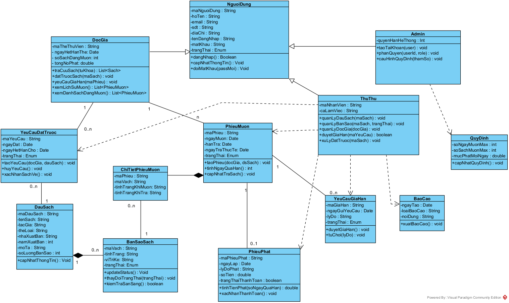

## 5.2. Biểu đồ tuần tự

### 5.2.1. Biểu đồ tuần tự đăng ký

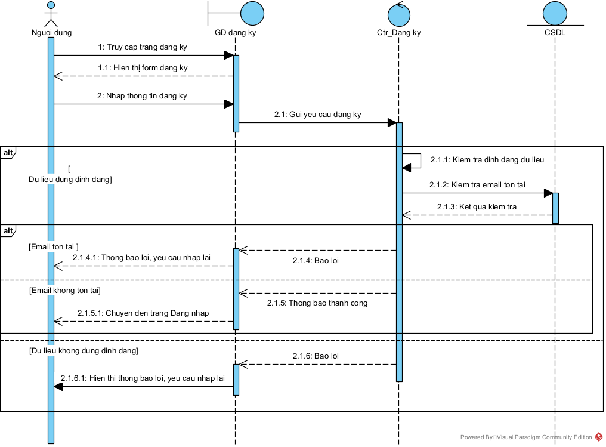

### 5.2.2. Biểu đồ tuần tự đăng nhập

### 5.2.3. Biểu đồ tuần tự Tra cứu thông tin sách

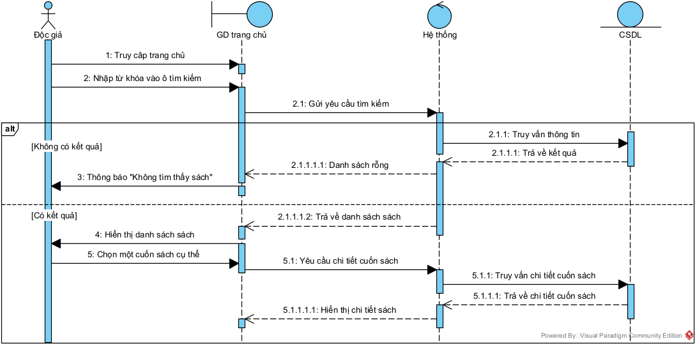

### 5.2.4. Biểu đồ tuần tự Đặt trước sách

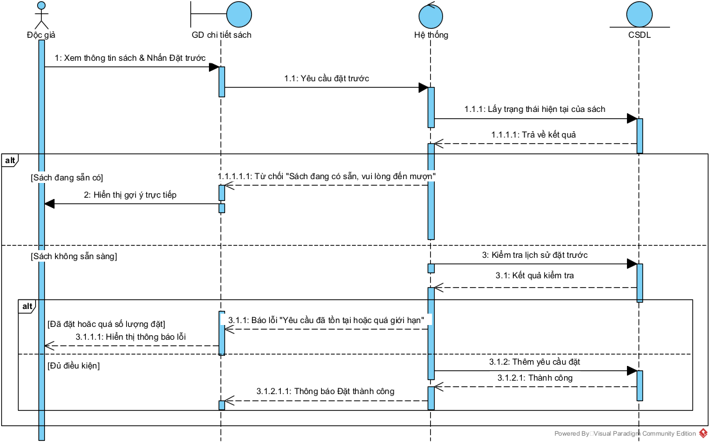

### 5.2.5. Biểu đồ tuần tự Yêu cầu gia hạn mượn

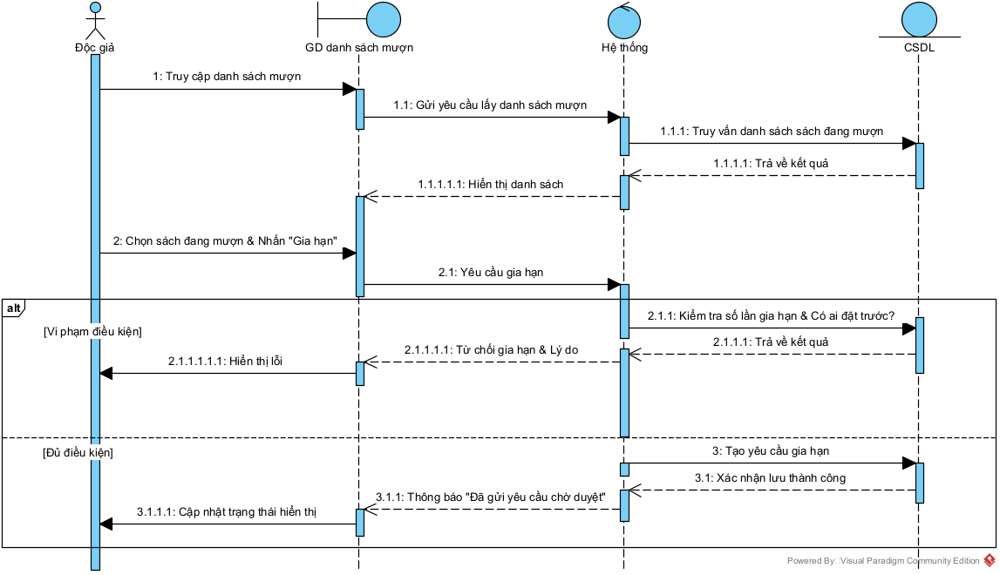

### 5.2.6. Biểu đồ tuần tự Xử lí gia hạn mượn

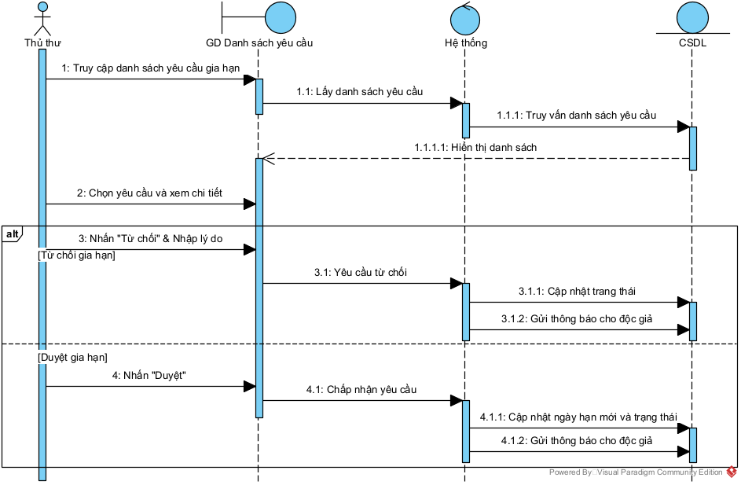

### 5.2.7. Biểu đồ tuần tự Lập phiếu mượn

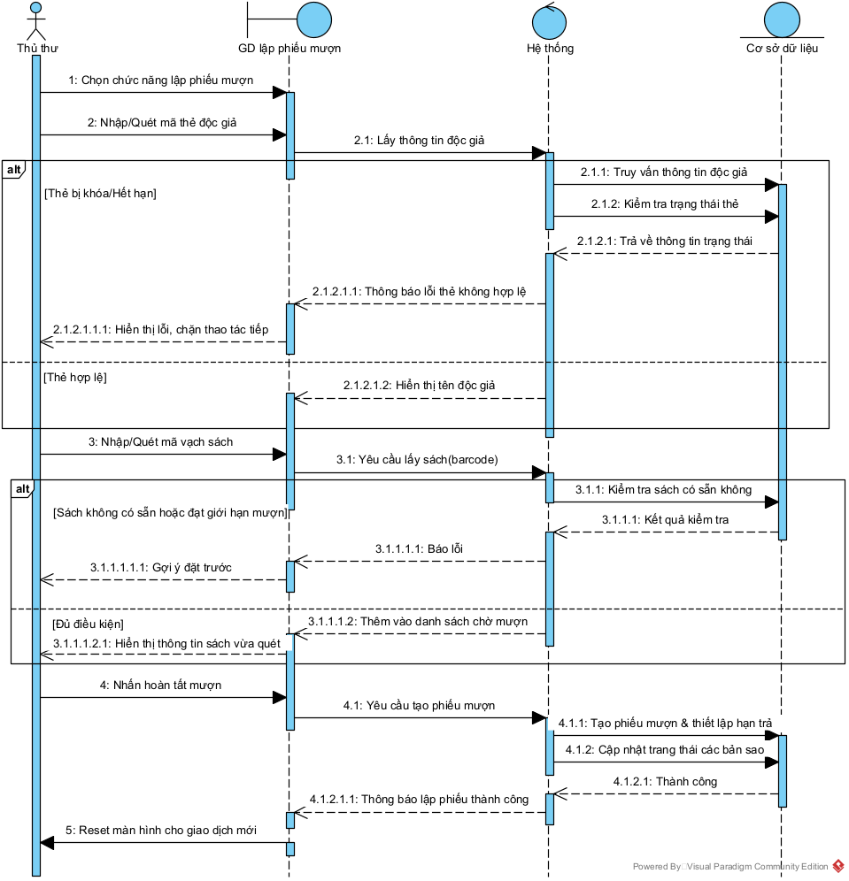

### 5.2.8. Biểu đồ tuần tự Đặt trước sách

### 5.2.9. Biểu đồ tuần tự Trả sách và Xử lí quá hạn

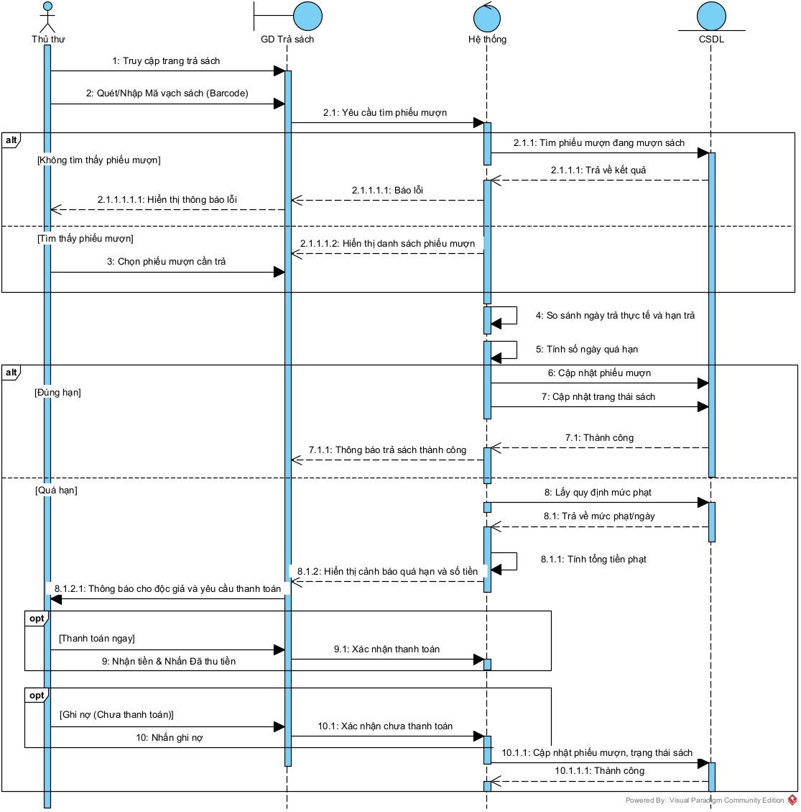

### 5.2.10. Biểu đồ tuần tự Quản lý đầu sách (Thêm mới)

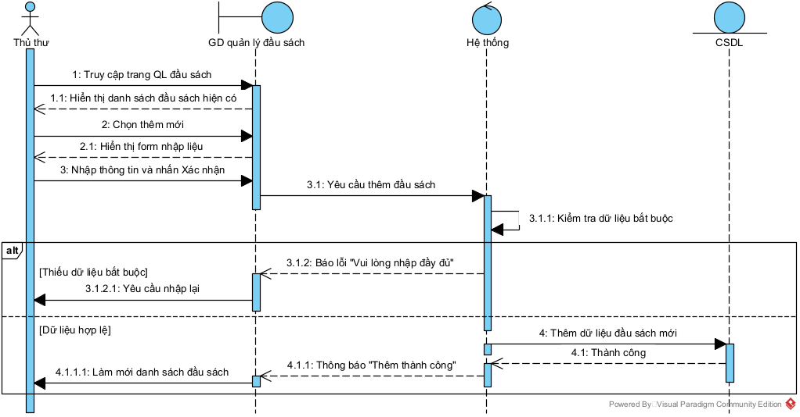

### 5.2.11. Biểu đồ tuần tự Quản lý đầu sách (Sửa)

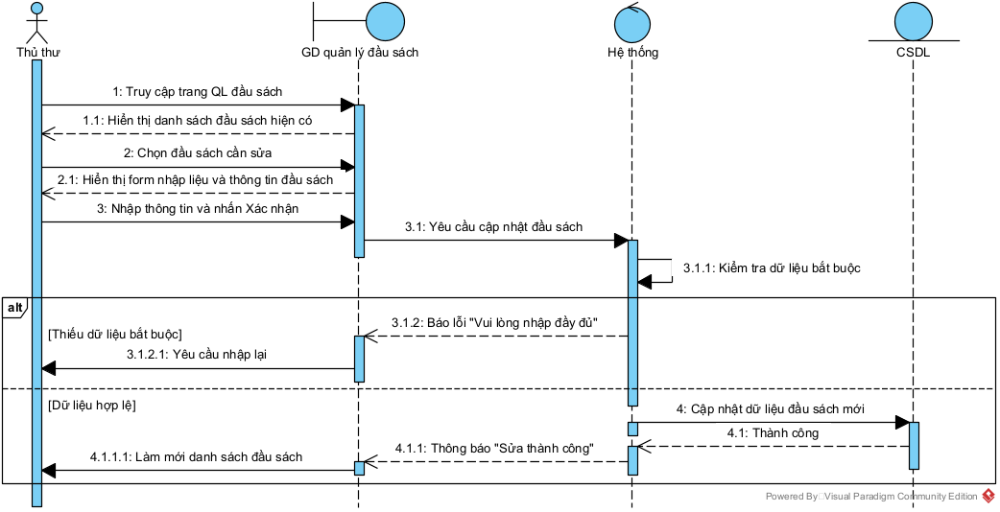

### 5.2.12. Biểu đồ tuần tự Quản lý đầu sách (Xóa)

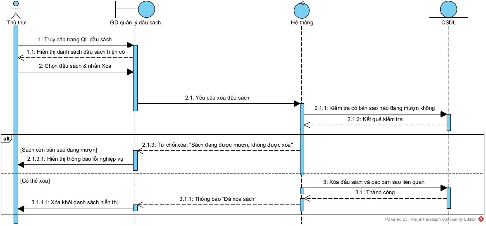

### 5.2.13. Biểu đồ tuần tự Quản lý bản sao sách (Thêm mới)

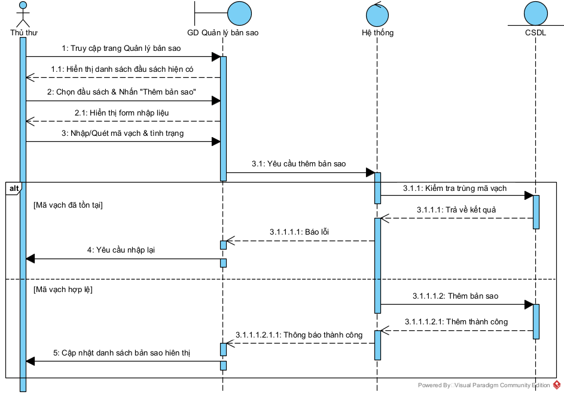

### 5.2.14. Biểu đồ tuần tự Quản lý độc giả (Thêm mới)

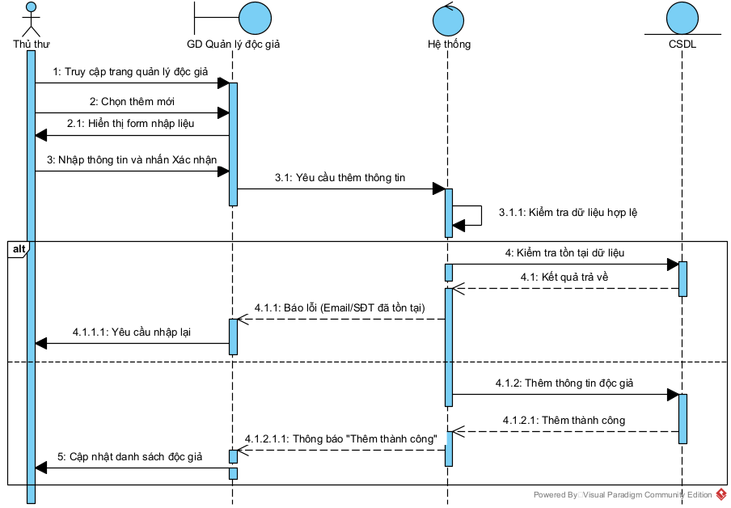

### 5.2.15. Biểu đồ tuần tự Thống kê báo cáo

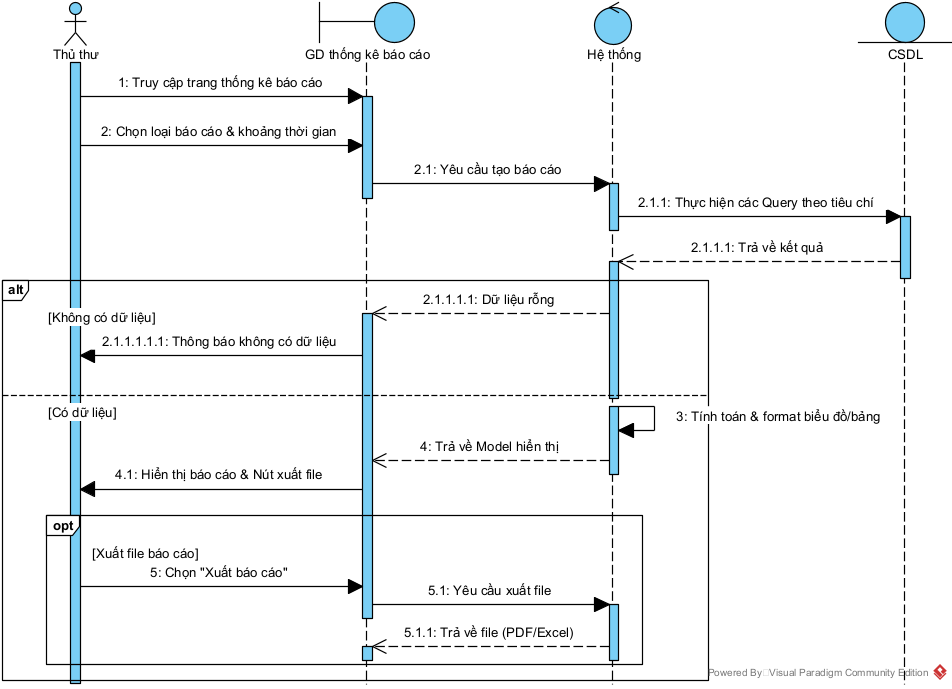

### 5.2.16. Biểu đồ tuần tự Cấu hình quy định hệ thống

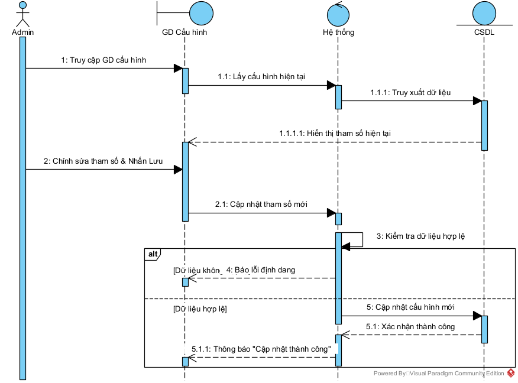

## 5.3. Biểu đồ hoạt động

### 5.3.1. Biểu đồ hoạt động đăng ký

### 5.3.2. Biểu đồ hoạt động đăng nhập

### 5.3.3. Biểu đồ hoạt động lấy lại mật khẩu

### 5.3.4. Biểu đồ hoạt động cấp mã sinh viên

### 5.3.5. Biểu đồ hoạt động muợn sách

### 5.3.6. Biểu đồ hoạt thêm sách mới

### 5.3.7. Biểu đồ hoạt động cập nhật sách

### 5.3.8. Biểu đồ hoạt động xóa sách

### 5.3.9. Biểu đồ hoạt động quản lý mượn sách

