# I. Giới thiệu đề tài

## 1. Lý do chọn đề tài

- Trong bối cảnh chuyển đổi số diễn ra mạnh mẽ, việc ứng dụng công nghệ thông tin vào công tác quản lý là nhu cầu tất yếu của các tổ chức, đặc biệt là trong lĩnh vực giáo dục và thư viện. Nhiều thư viện hiện nay vẫn quản lý sách, bạn đọc và nghiệp vụ mượn – trả bằng phương pháp thủ công hoặc các công cụ rời rạc, dẫn đến nhiều hạn chế như: tốn thời gian, dễ sai sót, khó thống kê báo cáo và không đáp ứng được nhu cầu tra cứu nhanh của bạn đọc.
- Việc xây dựng hệ thống quản lý thư viện giúp tự động hóa các quy trình nghiệp vụ, nâng cao hiệu quả quản lý, giảm chi phí vận hành, đồng thời cải thiện chất lượng phục vụ bạn đọc. Chính vì những lý do trên, đề tài “Xây dựng hệ thống quản lý thư viện” được lựa chọn để nghiên cứu và triển khai.

## 2. Mục tiêu của hệ thống

- Mục tiêu chính của hệ thống quản lý thư viện là:
  - Tin học hóa toàn bộ hoạt động quản lý thư viện.
  - Quản lý tập trung thông tin sách, bạn đọc và quá trình mượn - trả.
  - Hỗ trợ tra cứu sách nhanh chóng, chính xác.
  - Cung cấp các chức năng thống kê, báo cáo phục vụ công tác quản lý.
  - Nâng cao hiệu quả làm việc của thủ thư và chất lượng phục vụ bạn đọc.
  * Tin học hóa toàn bộ hoạt động quản lý thư viện.
  * Quản lý tập trung thông tin sách, bạn đọc và quá trình mượn - trả.
  * Hỗ trợ tra cứu sách nhanh chóng, chính xác.
  * Cung cấp các chức năng thống kê, báo cáo phục vụ công tác quản lý.
  * Nâng cao hiệu quả làm việc của thủ thư và chất lượng phục vụ bạn đọc.

## 3. Phạm vi và đối tượng sử dụng

- Phạm vi hệ thống: Hệ thống được xây dựng để quản lý các hoạt động cơ bản của một thư viện như: Quản lý sách, quản lý bạn đọc, mượn - trả sách và thống kê báo cáo.
- Đối tượng sử dụng:
  - Quản trị viên (Admin).
  - Thủ thư.
  - Độc giả.
  * Quản trị viên (Admin).
  * Thủ thư.
  * Độc giả.

## 4. Phương pháp nghiên cứu (Phân tích hướng đối tượng - UML)

- Đề tài sử dụng phương pháp phân tích và thiết kế hướng đối tượng kết hợp với ngôn ngữ mô hình hóa UML. Các biểu đồ UML được sử dụng bao gồm:
  - Biểu đồ Use Case: Mô tả các chức năng của hệ thống và mối quan hệ với tác nhân.
  - Biểu đồ Class: Mô tả cấu trúc dữ liệu và mối quan hệ giữa các lớp.
  - Biểu đồ Sequence: Mô tả trình tự tương tác giữa các đối tượng trong hệ thống
  - Biểu đồ Activity: Mô tả quy trình hoạt động của các tác nhân và hệ thống.

# II. Xác định tác nhân, phân tích chi tiết hệ thống

## 1. Các tác nhân trong hệ thống

### 1.1 Quản trị viên

- Vai trò: Quản lý toàn bộ hệ thống
- Quyền hạn:
  - Quản lý tài khoản thủ thư và người dùng.
  - Phân quyền hệ thống.
  - Cấu hình quy định thư viện (số sách được mượn, số ngày mượn, mức phạt ...).
  - Xem báo cáo, thống kê tổng hợp.
  - Sao lưu và phục hồi dữ liệu.

### 1.2 Thủ thư

- Vai trò: Quản lý nghiệp vụ thư viện hàng ngày
- Quyền hạn:
  - Quản lý đầu sách (thêm, sửa, xóa sách).
  - Quản lý bản sao sách (số lượng, vị trí)
  - Quản lý độc giả.
  - Thực hiện mượn - trả sách.
  - Gia hạn mượn sách.
  - Tính và thu tiền phạt.
  - Lập báo cáo thống kê

### 1.3 Độc giả

- Vai trò: Người sử dụng dịch vụ thư viện
- Quyền hạn:

  - Đăng ký tài khoản.
  - Tra cứu sách.
  - Xem tình trạng sách.
  - Mượn sách.
  - Trả sách.
  - Xem lịch sử mượn - trả.
  - Xem tiền phạt (nếu có).

## 2. Phân tích chi tiết hệ thống

### 2.1 Chức năng quản lý người dùng

- Biểu đồ Use Case: Mô tả các chức năng của hệ thống và mối quan hệ với tác nhân.
- Biểu đồ Class: Mô tả cấu trúc dữ liệu và mối quan hệ giữa các lớp.
- Biểu đồ Sequence: Mô tả trình tự tương tác giữa các đối tượng trong hệ thống
- Biểu đồ Activity: Mô tả quy trình hoạt động của các tác nhân và hệ thống.

# II. Xác định tác nhân, phân tích chi tiết hệ thống

## 1. Các tác nhân trong hệ thống

### 1.1 Quản trị viên

#### 2.1.1 Quản lý tài khoản

- Đăng ký tài khoản độc giả.
- Đăng nhập/ đăng xuất.
- Cập nhật thông tin cá nhân.
- Khóa/ mở khóa tài khoản.

### 1.2 Thủ thư

#### 2.1.2 Phân quyền

- Quyền hạn:
  - Admin: Toàn quyền.
  - Thủ thư: Nghiệp vụ thư viện.
  - Độc giả: Tra cứu, mượn, trả.

### 1.3 Độc giả

### 2.2 Chức năng quản lý sách

##### 2.2.1 Quản lý đầu sách

- Hệ thống quản lý thông tin ở mức đầu sách, bao gồm:
  - Mã đầu sách.
  - Tên sách.
  - Tác giả.
  - Thể loại.
  - Nhà xuất bản.
  - Năm xuất bản.
  - Mô tả nội dung.
- Một đầu sách có thể có nhiều bản sao với trạng thái khác nhau.

#### 2.2.2 Quản lý bản sao sách

- Hệ thống quản lý chi tiết từng bản sao của một đầu sách:
  - Mã bản sao.
  - Mã đầu sách.
  - Vị trí kệ.
  - Tình trạng:
    - Còn trong kho.
    - Đang được mượn.
    - Đặt trước.
    - Hư hỏng.
    - Mất.

## 2. Phân tích chi tiết hệ thống

### 2.1 Chức năng quản lý người dùng

#### 2.1.1 Quản lý tài khoản

### 2.3 Chức năng tra cứu sách

- Ngoài tra cứu cơ bản, hệ thống cho phép:
  - Hiển thị tổng số bản sao.
  - Hiện thị số bản đang còn/ đang mượn.

#### 2.1.2 Phân quyền

### 2.4 Chức năng mượn sách

#### 2.4.1 Điều kiện được mượn

- Hệ thống chỉ cho phép mượn khi:
  - Không có sách quá hạn.
  - Số sách đang mượn < Số sách tối đa cho phép.
  - Bản sao sách còn trong kho.

### 2.2 Chức năng quản lý sách

##### 2.2.1 Quản lý đầu sách

#### 2.4.2 Quy trình mượn sách

- Quy trình mượn sách:
  - Độc giả yêu cầu mượn sách.
  - Hệ thống kiểm tra điều kiện mượn.
  - Thủ thư xác nhận yếu cầu.
  - Hệ thống tạo phiếu mượn.
  - Cập nhật trạng thái bản sao -> Đang mượn.
- Thông tin phiếu mượn:
  - Mã phiếu.
  - Độc giả.
  - Danh sách bản sao mượn.
  - Ngày mượn.
  - Ngày trả dự kiến.
  - Thời gian mượn tối đa.

#### 2.2.2 Quản lý bản sao sách

### 2.5 Chức năng trả sách

#### 2.5.1 Quy trình trả sách

### 2.3 Chức năng tra cứu sách

- Độc giả trả sách.
- Thủ thư kiểm tra tình trạng bản sao.
- Hệ thống đối chiều ngày trả.
- Xử lý:

* Trả đúng hạn.
  - Trả trễ.
  - Hư hỏng.
  - Mất sách.

- Cập nhật trạng thái bản sao.

### 2.4 Chức năng mượn sách

#### 2.4.1 Điều kiện được mượn

- Hệ thống chỉ cho phép mượn khi:
  - Không có sách quá hạn.
  - Số sách đang mượn < Số sách tối đa cho phép.
  - Bản sao sách còn trong kho.

#### 2.4.2 Quy trình mượn sách

- Quy trình mượn sách:
  - Độc giả yêu cầu mượn sách.
  - Hệ thống kiểm tra điều kiện mượn.
  - Thủ thư xác nhận yếu cầu.
  - Hệ thống tạo phiếu mượn.
  - Cập nhật trạng thái bản sao -> Đang mượn.
- Thông tin phiếu mượn:
  - Mã phiếu.
  - Độc giả.
  - Danh sách bản sao mượn.
  - Ngày mượn.
  - Ngày trả dự kiến.
  - Thời gian mượn tối đa.

### 2.5 Chức năng trả sách

#### 2.5.1 Quy trình trả sách

- Độc giả trả sách.
- Thủ thư kiểm tra tình trạng bản sao.
- Hệ thống đối chiều ngày trả.
- Xử lý:
  - Trả đúng hạn.
  - Trả trễ.
  - Hư hỏng.
  - Mất sách.
- Cập nhật trạng thái bản sao.

### 2.6 Chức năng gia hạn mượn sách

- Điều kiện gia hạn:
  - Chưa quá hạn.
  - Không có độc giả khác đặt trước.
  - Chưa vượt số lần gia hạn cho phép.
- Thông tin gia hạn:
  - Ngày gia hạn.
  - Ngày trả mới.
  - Số lần gia hạn.

### 2.7 Chức năng xử lý tiền phạt

#### 2.7.1 Các loại vi phạm

- Trả sách trễ hạn.
- Làm hư hỏng sách.
- Làm mất sách.

#### 2.7.2 Cơ chế tính phạt

- Phạt trễ hạn: theo số ngày trễ.
- Phạt mất/ hỏng: theo % giá trị sách.
- Có thể cấu hình mức phạt trong hệ thống.

#### 2.7.3 Xử lý nghiệp vụ

- Ghi nhận vi phạm vào hồ sơ độc giả.
- Tạm khóa quyền mượn nếu vi phạm nghiêm trọng.
- Tích hợp thanh toán tiền phạt (nếu có).

### 2.8 Chức năng báo cáo và thống kê

#### 2.8.1 Báo cáo nghiệp vụ

- Danh sách sách đang mượn.
- Danh sách sách quá hạn.
- Độc giả vi phạm.

#### 2.8.2 Thống kê khai thác thư viện

- Tần suất mượn theo thời gian.
- Sách được mượn nhiều/ ít.
- Hiệu quả sử dụng tài nguyên.
- Thống kê theo thể loại.

### 2.9 Chức năng cấu hình quy định thư viện

- Admin có thể cấu hình:
  - Số sách được mượn tối đa.
  - Thời gian mượn tối đa.
  - Số lần gia hạn.
  - Mức phạt

# III. BIỂU ĐỒ USE CASE

## 1 Xây dựng biểu đồ use case

### 1.1 Biểu đồ use case tổng quát

### 1.2 Biểu đồ use case xử lý quá hạn

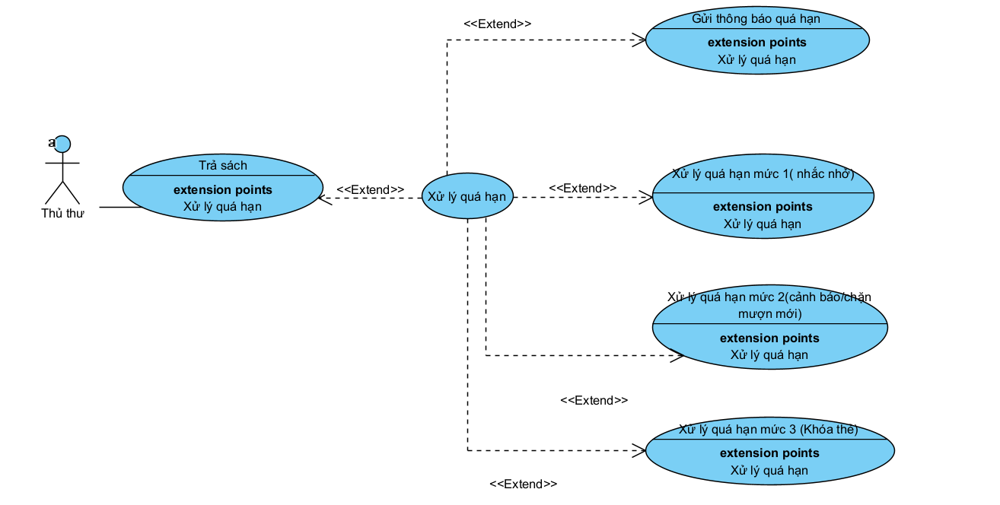

### 1.3 Biểu đồ use case đặt trước sách

## 2 Mô tả hoạt động cơ bản của từng use case

### 2.1 Đăng nhập

Người dùng đăng nhập hệ thống bằng cách nhập tên đăng nhập và mật khẩu để truy cập vào hệ thống. Hệ thống kiểm tra thông tin đăng nhập với dữ liệu đã lưu trên cơ sở dữ liệu. Nếu hợp lệ, người dùng được phép sử dung các chức năng theo quyền của người dùng. Nếu không hợp lệ, hệ thống hiển thị thông báo lỗi và yêu cầu đăng nhập lại.

### 2.2 Tra cứu thông tin sách

Độc giả thực hiện chức năng tìm kiếm thông tin sách bằng cách tra cứu theo tên sách, tác giả hoặc thể loại phù hợp. Hệ thống xử lý yêu cầu và hiển thị danh sách phù hợp. Độc giả có thể xem thông tin chi tiết và tình trạng của từng cuốn sách.

### 2.3 Đặt trước sách

Độc giả gửi yêu cầu đặt trước đối với sách đang muốn mượn. Hệ thống ghi nhận yêu cầu và vào danh sách chờ. Khi có sách, hệ thống gửi thông báo đến độc giả đến lấy sách.

### 2.4 Yêu cầu gia hạn mượn sách

Độc giả yêu cầu gia hạn sách đối với sách đang mượn. Hệ thống chuyển yêu cầu đến thủ thư để xem xét yêu cầu. Sau khi được duyệt, hạn trả sách mới sẽ được cập nhật cho độc giả.

### 2.5 Xem danh sách mượn / lịch sử mượn sách

Độc giả xem danh sách đang mượn. Hệ thống hiển thị lịch sử các lần mượn sách trước đây. Thông tin giúp độc giả theo dõi tình trạng mượn sách của mình.

### 2.6 Quản lý đầu sách

Thủ thư thực hiện thêm, sửa hoặc xóa thông tin đầu sách.
Các thông tin bao gồm tên sách, tác giả, thể loại và nhà xuất bản. Dữ liệu được lưu và cập nhật trong hệ thống thư viện.

### 2.7 Quản lý bản sao (gán mã vạch, tình trạng)

Thủ thư quản lý từng bản sao cụ thể của sách.
Mỗi bản sao được gán mã vạch và trạng thái sử dụng.
Hệ thống cập nhật tình trạng để phục vụ mượn và trả sách.

### 2.8 Quản lý độc giả

Thủ thư tạo mới, chỉnh sửa hoặc khóa thẻ của độc giả. Thông tin độc giả được quản lý tập trung trong hệ thống. Việc quản lý giúp kiểm soát quyền mượn sách của độc giả.

### 2.9 Lập phiếu mượn

Thủ thư kiểm tra thông tin thẻ của độc giả và tình trạng sách. Sau đó lập phiếu mượn cho độc giả. Hệ thống ghi nhận ngày mượn và cập nhật hạn trả sách.

### 2.10 Trả sách

Thủ thư tiếp nhận sách do độc giả trả lại.
Hệ thống cập nhật trạng thái sách sang đã trả.
Nếu sách quá hạn, hệ thống chuyển sang xử lý tiền phạt.

### 2.11 Xử lý quá hạn (tính và thu tiền phạt)

Hệ thống xác định số ngày quá hạn trả sách. Tiền phạt được tính theo quy định của thư viện. Thủ thư thu tiền và cập nhật trạng thái hoàn tất.

### 2.12 Thống kê báo cáo

Thủ thư yêu cầu tạo báo cáo thống kê.
Hệ thống tổng hợp dữ liệu mượn, trả và vi phạm.
Báo cáo phục vụ công tác quản lý thư viện.

### 2.13 Quản lý tài khoản và phân quyền hệ thống

Admin tạo và quản lý tài khoản người dùng hệ thống.
Thực hiện phân quyền truy cập theo vai trò.
Đảm bảo an toàn và kiểm soát hệ thống.

### 2.14 cấu hình quy định

Admin thiết lập các quy định hoạt động của thư viện.
Bao gồm thời gian mượn, số sách mượn và mức phạt.
Các quy định được áp dụng thống nhất toàn hệ thống.

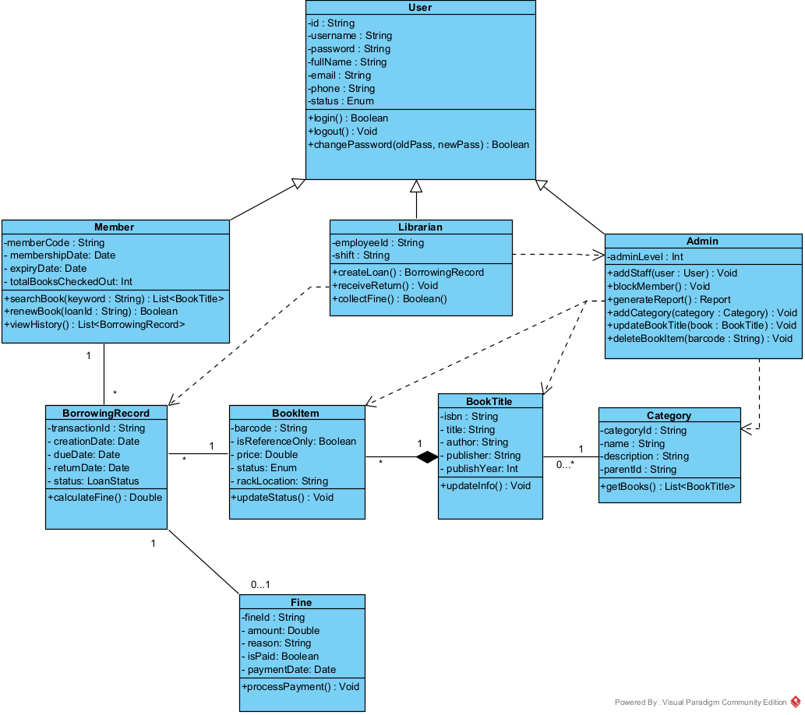

# CHƯƠNG 5:THIẾT KẾ HỆ THỐNG

## 5.3. Biểu đồ hoạt động

### 5.3.1. Biểu đồ hoạt động đăng ký
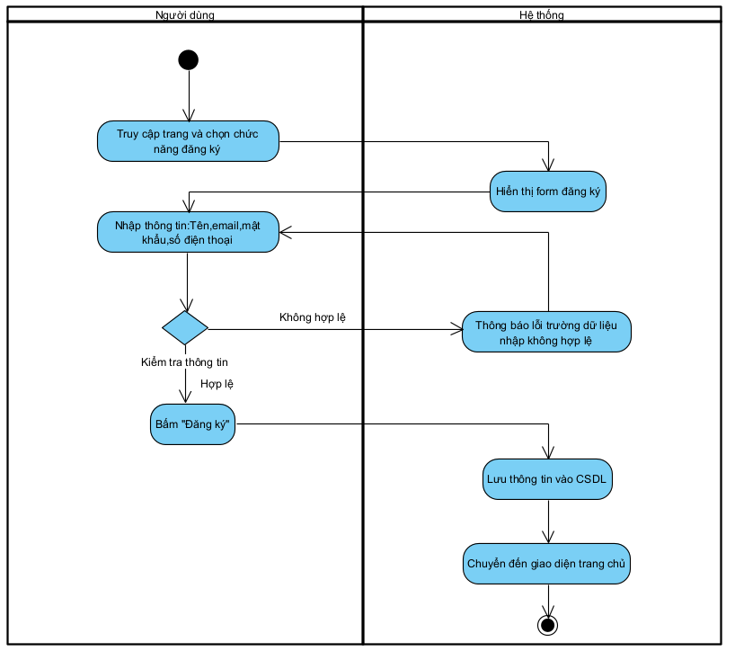

### 5.3.2. Biểu đồ hoạt động đăng nhập
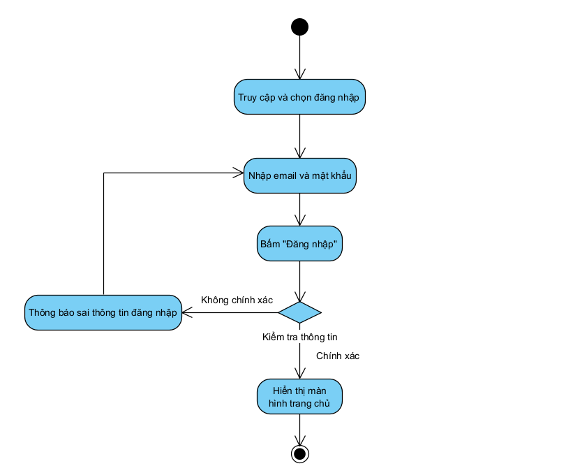

### 5.3.3. Biểu đồ hoạt động lấy lại mật khẩu
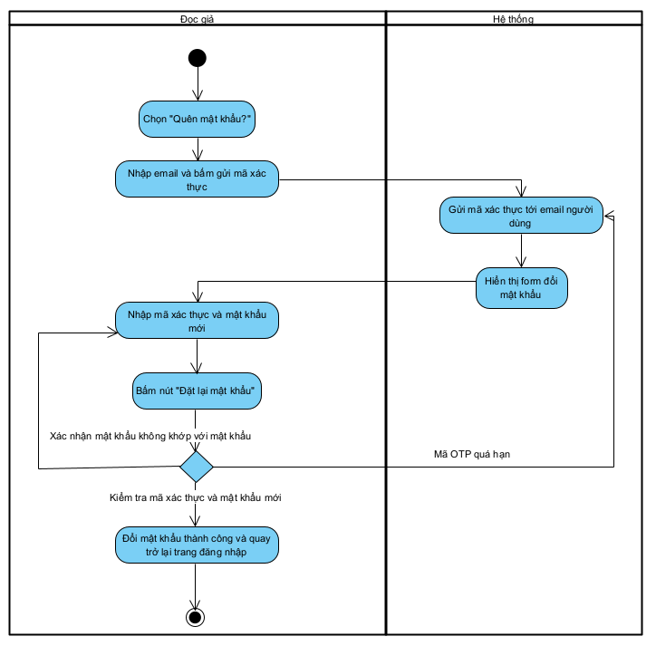

### 5.3.4. Biểu đồ hoạt động cấp mã sinh viên
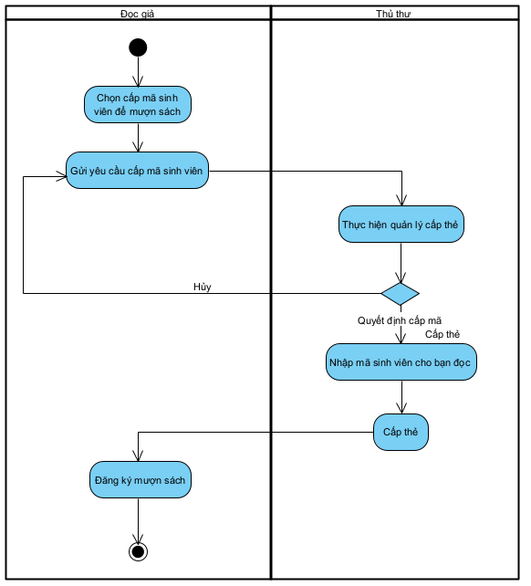

### 5.3.5. Biểu đồ hoạt động muợn sách

### 5.3.6. Biểu đồ hoạt thêm sách mới
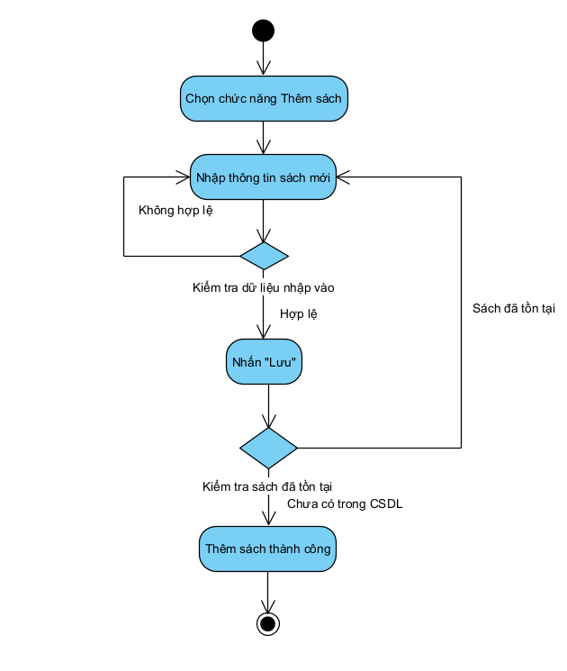

### 5.3.7. Biểu đồ hoạt động cập nhật sách
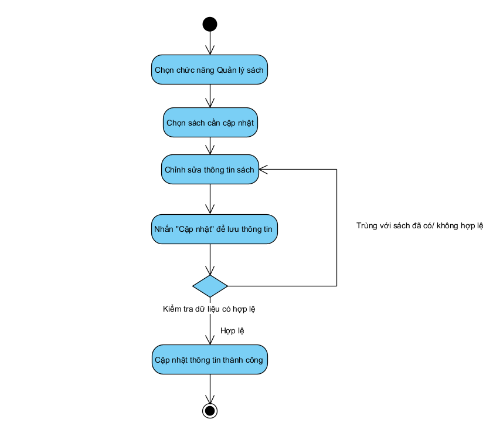

### 5.3.8. Biểu đồ hoạt động xóa sách
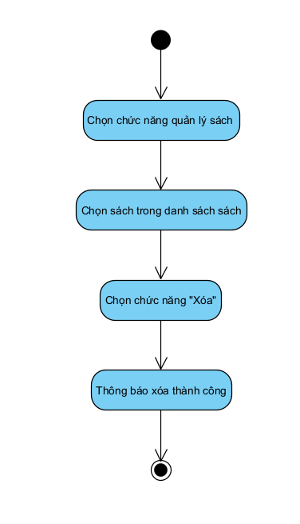

### 5.3.9. Biểu đồ hoạt động quản lý mượn sách
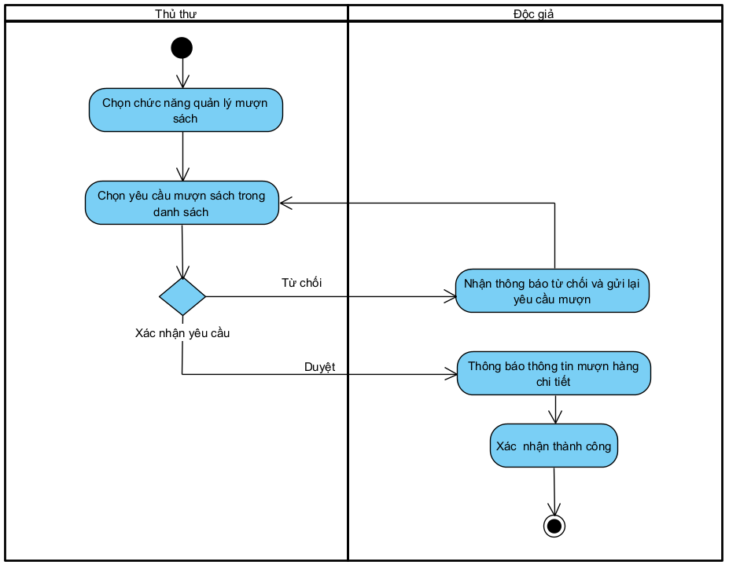

### 5.3.10. Biểu đồ hoạt động đặt trước sách của đọc giả
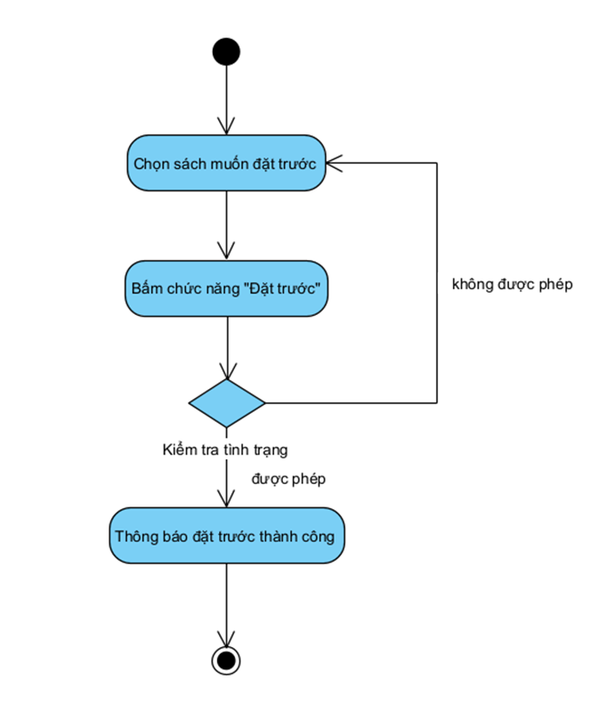

### 5.3.11. Biểu đồ hoạt động gia hạn mượn sách của đọc giả
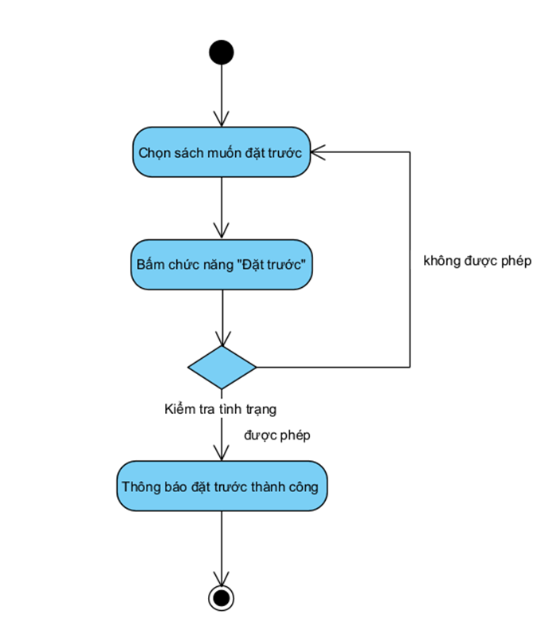

### 5.3.11. Biểu đồ hoạt động trả sách của đọc giả
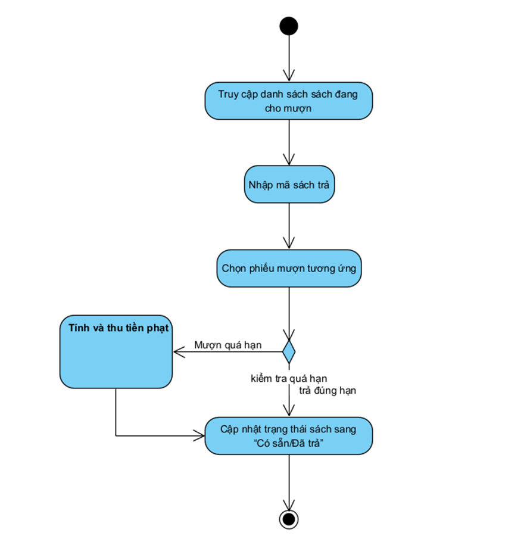

### 5.3.11. Biểu đồ hoạt động tra cứu lịch sử mượn sách của đọc giả
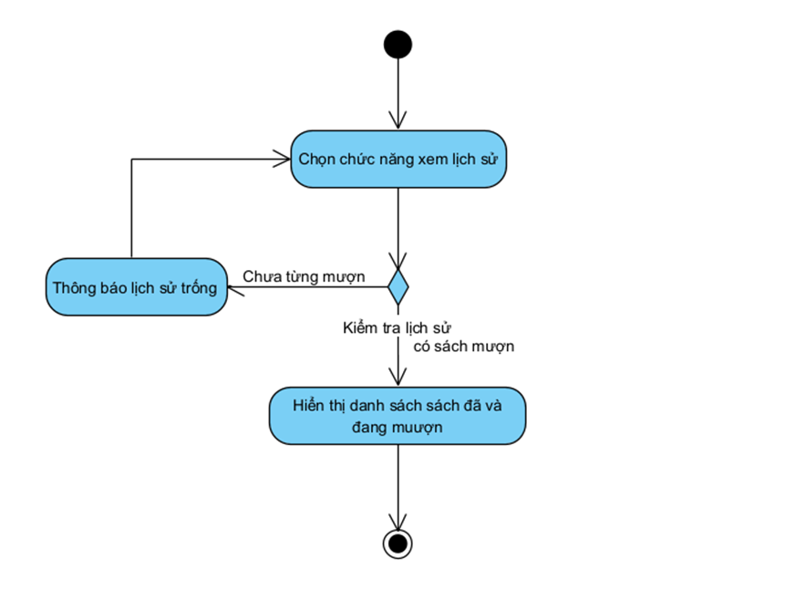