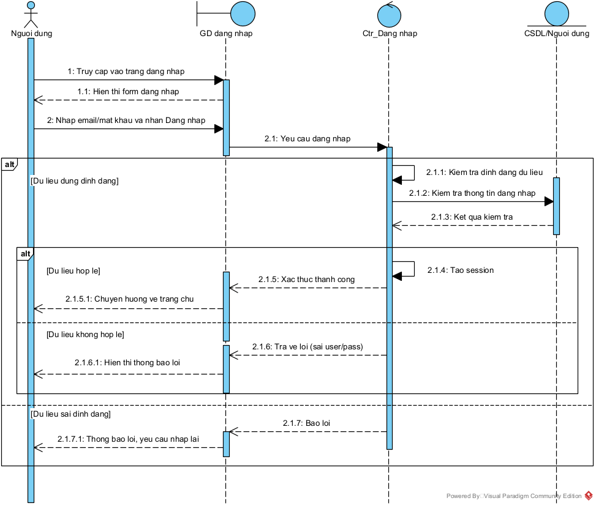

# I. Giới thiệu đề tài

## 1. Lý do chọn đề tài

- Trong bối cảnh chuyển đổi số diễn ra mạnh mẽ, việc ứng dụng công nghệ thông tin vào công tác quản lý là nhu cầu tất yếu của các tổ chức, đặc biệt là trong lĩnh vực giáo dục và thư viện. Nhiều thư viện hiện nay vẫn quản lý sách, bạn đọc và nghiệp vụ mượn – trả bằng phương pháp thủ công hoặc các công cụ rời rạc, dẫn đến nhiều hạn chế như: tốn thời gian, dễ sai sót, khó thống kê báo cáo và không đáp ứng được nhu cầu tra cứu nhanh của bạn đọc.
- Việc xây dựng hệ thống quản lý thư viện giúp tự động hóa các quy trình nghiệp vụ, nâng cao hiệu quả quản lý, giảm chi phí vận hành, đồng thời cải thiện chất lượng phục vụ bạn đọc. Chính vì những lý do trên, đề tài “Xây dựng hệ thống quản lý thư viện” được lựa chọn để nghiên cứu và triển khai.

## 2. Mục tiêu của hệ thống

- Mục tiêu chính của hệ thống quản lý thư viện là:

  - Tin học hóa toàn bộ hoạt động quản lý thư viện.
  - Quản lý tập trung thông tin sách, bạn đọc và quá trình mượn - trả.
  - Hỗ trợ tra cứu sách nhanh chóng, chính xác.
  - Cung cấp các chức năng thống kê, báo cáo phục vụ công tác quản lý.
  - Nâng cao hiệu quả làm việc của thủ thư và chất lượng phục vụ bạn đọc.

  * Tin học hóa toàn bộ hoạt động quản lý thư viện.
  * Quản lý tập trung thông tin sách, bạn đọc và quá trình mượn - trả.
  * Hỗ trợ tra cứu sách nhanh chóng, chính xác.
  * Cung cấp các chức năng thống kê, báo cáo phục vụ công tác quản lý.
  * Nâng cao hiệu quả làm việc của thủ thư và chất lượng phục vụ bạn đọc.

## 3. Phạm vi và đối tượng sử dụng

- Phạm vi hệ thống: Hệ thống được xây dựng để quản lý các hoạt động cơ bản của một thư viện như: Quản lý sách, quản lý bạn đọc, mượn - trả sách và thống kê báo cáo.
- Đối tượng sử dụng:

  - Quản trị viên (Admin).
  - Thủ thư.
  - Độc giả.

  * Quản trị viên (Admin).
  * Thủ thư.
  * Độc giả.

## 4. Phương pháp nghiên cứu (Phân tích hướng đối tượng - UML)

- Đề tài sử dụng phương pháp phân tích và thiết kế hướng đối tượng kết hợp với ngôn ngữ mô hình hóa UML. Các biểu đồ UML được sử dụng bao gồm:
  - Biểu đồ Use Case: Mô tả các chức năng của hệ thống và mối quan hệ với tác nhân.
  - Biểu đồ Class: Mô tả cấu trúc dữ liệu và mối quan hệ giữa các lớp.
  - Biểu đồ Sequence: Mô tả trình tự tương tác giữa các đối tượng trong hệ thống
  - Biểu đồ Activity: Mô tả quy trình hoạt động của các tác nhân và hệ thống.

# II. Xác định tác nhân, phân tích chi tiết hệ thống

## 1. Các tác nhân trong hệ thống

### 1.1 Quản trị viên

- Vai trò: Quản lý toàn bộ hệ thống
- Quyền hạn:
  - Quản lý tài khoản thủ thư và người dùng.
  - Phân quyền hệ thống.
  - Cấu hình quy định thư viện (số sách được mượn, số ngày mượn, mức phạt ...).
  - Xem báo cáo, thống kê tổng hợp.
  - Sao lưu và phục hồi dữ liệu.

### 1.2 Thủ thư

- Vai trò: Quản lý nghiệp vụ thư viện hàng ngày
- Quyền hạn:
  - Quản lý đầu sách (thêm, sửa, xóa sách).
  - Quản lý bản sao sách (số lượng, vị trí)
  - Quản lý độc giả.
  - Thực hiện mượn - trả sách.
  - Gia hạn mượn sách.
  - Tính và thu tiền phạt.
  - Lập báo cáo thống kê

### 1.3 Độc giả

- Vai trò: Người sử dụng dịch vụ thư viện
- Quyền hạn:
  - Đăng ký tài khoản.
  - Tra cứu sách.
  - Xem tình trạng sách.
  - Mượn sách.
  - Trả sách.
  - Xem lịch sử mượn - trả.
  - Xem tiền phạt (nếu có).

## 2. Phân tích chi tiết hệ thống

### 2.1 Chức năng quản lý người dùng

#### 2.1.1 Quản lý tài khoản

- Đăng ký tài khoản độc giả.
- Đăng nhập/ đăng xuất.
- Cập nhật thông tin cá nhân.
- Khóa/ mở khóa tài khoản.

#### 2.1.2 Phân quyền

- Quyền hạn:
  - Admin: Toàn quyền.
  - Thủ thư: Nghiệp vụ thư viện.
  - Độc giả: Tra cứu, mượn, trả.

### 2.2 Chức năng quản lý sách

##### 2.2.1 Quản lý đầu sách

- Hệ thống quản lý thông tin ở mức đầu sách, bao gồm:
  - Mã đầu sách.
  - Tên sách.
  - Tác giả.
  - Thể loại.
  - Nhà xuất bản.
  - Năm xuất bản.
  - Mô tả nội dung.
- Một đầu sách có thể có nhiều bản sao với trạng thái khác nhau.

#### 2.2.2 Quản lý bản sao sách

- Hệ thống quản lý chi tiết từng bản sao của một đầu sách:
  - Mã bản sao.
  - Mã đầu sách.
  - Vị trí kệ.
  - Tình trạng:
    - Còn trong kho.
    - Đang được mượn.
    - Đặt trước.
    - Hư hỏng.
    - Mất.

### 2.3 Chức năng tra cứu sách

- Ngoài tra cứu cơ bản, hệ thống cho phép:
  - Hiển thị tổng số bản sao.
  - Hiện thị số bản đang còn/ đang mượn.

### 2.4 Chức năng mượn sách

#### 2.4.1 Điều kiện được mượn

- Hệ thống chỉ cho phép mượn khi:
  - Không có sách quá hạn.
  - Số sách đang mượn < Số sách tối đa cho phép.
  - Bản sao sách còn trong kho.

#### 2.4.2 Quy trình mượn sách

- Quy trình mượn sách:
  - Độc giả yêu cầu mượn sách.
  - Hệ thống kiểm tra điều kiện mượn.
  - Thủ thư xác nhận yếu cầu.
  - Hệ thống tạo phiếu mượn.
  - Cập nhật trạng thái bản sao -> Đang mượn.
- Thông tin phiếu mượn:
  - Mã phiếu.
  - Độc giả.
  - Danh sách bản sao mượn.
  - Ngày mượn.
  - Ngày trả dự kiến.
  - Thời gian mượn tối đa.

### 2.5 Chức năng trả sách

#### 2.5.1 Quy trình trả sách

- Độc giả trả sách.
- Thủ thư kiểm tra tình trạng bản sao.
- Hệ thống đối chiều ngày trả.
- Xử lý:
  - Trả đúng hạn.
  - Trả trễ.
  - Hư hỏng.
  - Mất sách.
- Cập nhật trạng thái bản sao.

### 2.6 Chức năng gia hạn mượn sách

- Điều kiện gia hạn:
  - Chưa quá hạn.
  - Không có độc giả khác đặt trước.
  - Chưa vượt số lần gia hạn cho phép.
- Thông tin gia hạn:
  - Ngày gia hạn.
  - Ngày trả mới.
  - Số lần gia hạn.

### 2.7 Chức năng xử lý tiền phạt

#### 2.7.1 Các loại vi phạm

- Trả sách trễ hạn.
- Làm hư hỏng sách.
- Làm mất sách.

#### 2.7.2 Cơ chế tính phạt

- Phạt trễ hạn: theo số ngày trễ.
- Phạt mất/ hỏng: theo % giá trị sách.
- Có thể cấu hình mức phạt trong hệ thống.

#### 2.7.3 Xử lý nghiệp vụ

- Ghi nhận vi phạm vào hồ sơ độc giả.
- Tạm khóa quyền mượn nếu vi phạm nghiêm trọng.
- Tích hợp thanh toán tiền phạt (nếu có).

### 2.8 Chức năng báo cáo và thống kê

#### 2.8.1 Báo cáo nghiệp vụ

- Danh sách sách đang mượn.
- Danh sách sách quá hạn.
- Độc giả vi phạm.

#### 2.8.2 Thống kê khai thác thư viện

- Tần suất mượn theo thời gian.
- Sách được mượn nhiều/ ít.
- Hiệu quả sử dụng tài nguyên.
- Thống kê theo thể loại.

### 2.9 Chức năng cấu hình quy định thư viện

- Admin có thể cấu hình:
  - Số sách được mượn tối đa.
  - Thời gian mượn tối đa.
  - Số lần gia hạn.
  - Mức phạt.

# III. BIỂU ĐỒ USE CASE

## 1 Xây dựng biểu đồ use case

### 1.1 Biểu đồ use case tổng quát

### 1.2 Biểu đồ use case xử lý quá hạn

### 1.3 Biểu đồ use case đặt trước sách

### 1.4 Biểu đồ use case thống kê báo cáo

### 1.5 Biểu đồ use case mượn sách

### 1.6 Biểu đồ use case phân quyền hệ thống

### 1.7 Biểu đồ use case quản lý bản sao sách

### 1.8 Biểu đồ use case gia hạn mượn sách

## 2 Vai trò của các Actor

### 2.1 Vai trò của độc giả

| Thuộc tính                | Mô tả                                                                                                                                                                                                                                             |
| --------------------------- | --------------------------------------------------------------------------------------------------------------------------------------------------------------------------------------------------------------------------------------------------- |
| Tên actor                  | Độc giả                                                                                                                                                                                                                                          |
| Mô tả                     | Độc giả xây dựng hệ thống tra sách, theo dõi việc mượn/trả và thực hiện các yêu cầu dịch vụ như đặt trước hoặc xin gia hạn. Độc giả tương tác thông qua giao diện hệ thống  sau khi đăng nhập.  |
| Mục tiêu                  | Giúp độc giả tìm được sách cần đọc, sử dụng dịch vụ thư viện thuận tiện, quản lý việc  mượn sách và tránh vi phạm quá hạn.                                                                                      |
| Vai trò                    | Người sử dụng dịch vụ thư viện trên hệ thống; chủ động tra cứu, gửi yêu cầu đặt trước/gia hạn và theo dõi lịch sử mượn.                                                                                           |
| Trách nhiệm               | - Đăng nhập hệ thống để sử dụng chức năng cá nhân - Tra cứu thông tin sách - Đặt trước sách khi sách không sẵn có - Gửi yêu cầu gia hạn mượn - Xem danh sách đang mượn và lịch sử mượn |
| Yêu cầu đối với actor: | Có tài khoản hợp lệ; cung cấp thông tin cá nhân chính xác; tuân thủ quy định  mượn–trả và thời hạn mượn của thư viện.                                                                                               |
| Use case tương ứng       | - Đăng nhập - Tra cứu thông tin sách - Đặt trước sách - Yêu cầu gia hạn thời gian mượn Xem danh sách mượn/lịch sử mượn                                                                                  |

### 2.2 vai trò của Thủ Thư

| Thuộc tính          | Mô tả                                                                                                                                                                                                                                                                                                                                                                                                           |
| --------------------- | ----------------------------------------------------------------------------------------------------------------------------------------------------------------------------------------------------------------------------------------------------------------------------------------------------------------------------------------------------------------------------------------------------------------- |
| Tên actor            | Thủ thư                                                                                                                                                                                                                                                                                                                                                                                                         |
| Mô tả               | Thủ thư vận hành các nghiệp vụ chính của thư viện: quản lý sách, quản lý độc giả,  xử lý mượn–trả,gia hạn, đặt trước và thu tiền phạt. Thủ thư cập nhật dữ liệu để  đảm bảo hoạt động thư viện chính xác.                                                                                                                                           |
| Mục tiêu            | Đảm bảo quy trình mượn–trả diễn ra đúng quy định, dữ liệu sách/độc giả luôn cập nhật, hỗ trợ quản lý vận hành và báo cáo.                                                                                                                                                                                                                                                     |
| Vai trò              | Nhân viên nghiệp vụ trực tiếp xử lý giao dịch mượn–trả và quản trị dữ liệu hoạt động hằng ngày của thư viện.                                                                                                                                                                                                                                                                       |
| Trách nhiệm         | - Đăng nhập hệ thống để thao tác nghiệp vụ - Quản lý đầu sách và cập nhật thông tin sách - Quản lý bản sao (Mã vạch, tình trạng) - Quản lý đọc giả (thêm/sửa/khóa thẻ) - Lập phiếu mượn, xử lý trả sách - Tính và thu tiền phạt khi quá hạn - Xử lý đặt trước, duyệt gia hạn mượn - Thống kê và lập báo cáo |
| Yêu cầu với actor  | Có tài khoản thủ thư và quyền thao tác; nhập liệu chính xác; tuân thủ quy trình  nghiệp vụ và quy định thư viện.                                                                                                                                                                                                                                                                       |
| Use case tương ứng | - Đăng nhập - Quản lý đầu sách - Quản lý bản sao (gán mã vạch, tình trạng) - Quản lý độc giả (thêm/sửa/khóa thẻ) - Lập phiếu mượn - Trả sách - Tính và thu tiền phạt (xử lý quá hạn) - Xử lý đặt trước - Gia hạn mượn - Thống kê báo cáo                                                                         |

### 2.3 Vai trò của Admin hệ thống

| Thuộc tính               | Mô tả                                                                                                                                                                                                                                                                   |
| -------------------------- | ------------------------------------------------------------------------------------------------------------------------------------------------------------------------------------------------------------------------------------------------------------------------- |
| Tên actor                 | Admin hê thống                                                                                                                                                                                                                                                          |
| Mô tả                    | Admin chịu trách nhiệm quản trị hệ thống: quản lý tài khoản người dùng và phân quyền,  cấu hình các quy định vận hành áp dụng chung cho toàn hệ thống thư viện.                                                                       |
| Mục tiêu                 | Đảm bảo hệ thống hoạt động ổn định, an toàn; quyền truy cập đúng vai trò; các quy định được cấu hình thống nhất và dễ quản lý                                                                                                         |
| Vai trò                   | Quản trị viên hệ thống, kiểm soát quyền truy cập và thiết lập cấu hình/quy định hệ thống.                                                                                                                                                               |
| Trách nhiệm              | - Đăng nhập hệ thống với quyền quản trị - Quản lý tài khoản và phân quyền hệ thống - Cấu hính quy định (Thời gian mượn, mức phạt, giới hạn mượn...) - Theo dõi và đảm bảo tính nhất quán dữ liệu theo quy định |
| Yêu cầu đối với actor | Có tài khoản admin; hiểu cấu trúc quyền và quy định thư viện; cấu hình đúng để không  ảnh hưởng vận hành.                                                                                                                                    |
| Use case tương ứng      | - Đăng nhập - Quản lý tài khoản và phân quyền hệ thống - Cấu hình quy định                                                                                                                                                                      |

## 3 kịch bản hoạt động use case

### 3.1 Use case đăng ký

| Mục               | Nội dung                                                                                                                                                                                                                                                                                                                                                                                                                                                                                                                                                                                                                                                                               |
| ------------------ | --------------------------------------------------------------------------------------------------------------------------------------------------------------------------------------------------------------------------------------------------------------------------------------------------------------------------------------------------------------------------------------------------------------------------------------------------------------------------------------------------------------------------------------------------------------------------------------------------------------------------------------------------------------------------------------- |
| Tên Use case      | Đăng ký                                                                                                                                                                                                                                                                                                                                                                                                                                                                                                                                                                                                                                                                              |
| Actor chính       | Độc giả                                                                                                                                                                                                                                                                                                                                                                                                                                                                                                                                                                                                                                                                              |
| Mô tả            | Use case cho phép người dùng mới (độc giả) tạo tài khoản để sử dụng các dịch vụ của hệ thống quản lý thư viện  như tra cứu sách, mượn sách, đặt trước và gia hạn mượn.                                                                                                                                                                                                                                                                                                                                                                                                                                                                      |
| Tiền điều kiện | - Cung cấp thông tin xác thực                                                                                                                                                                                                                                                                                                                                                                                                                                                                                                                                                                                                                                                       |
| Hậu điều kiện  | - Tài khoản độc giả được tạo thành công và lưu trong cơ sở dữ liệu - Người dùng cố thể đăng nhập để sử dụng hệ thống                                                                                                                                                                                                                                                                                                                                                                                                                                                                                                                               |
| Luông chính      | - Người dùng truy cập website hệ thống thư viện - Chọn chức năng đăng ký - Hệ thống hiển thị form đăng ký tài khoản -Người dùng nhập đầy đủ thông tin cá nhân (họ tên, email, số điện thoại,mật khẩu, địa chỉ...) - Người dùng xác nhận đăng ký - Hệ thống kiểm tra tính hợp lệ của thông tin (định dạng email, độ mạnh mật khẩu, dữ liệu bắt buộc) - Hệ hống kiểm tra email/số điện thoại có tồn tại trong hệ thống hay không - Hệ thống lưu trữ thông tin tài khoản vào co sở dũ liệu -Hệ thống thông báo đăng ký thành công |
| Luồng phụ        | - Nếu thông tin không hợp lệ: Hệ thống hiển thị thông báo lỗi và yêu cầu người dùng nhập lại - Email hoặc số điện thoại đã tồn tại: Hệ thống thông báo tài khoản đã tồn tại, yêu cầu sử dụng thông tin khác - Người dùng nhập thiếu thông tin :Hệ thống yêu cầu bổ sung thông tin bắt bu                                                                                                                                                                                                                                                                                                                          |
| Kết quả          | Tài khoản độc giả được tạo thành công                                                                                                                                                                                                                                                                                                                                                                                                                                                                                                                                                                                                                                        |

### 3.2 Use case đăng nhập

**Bảng: Quy trình đăng nhập**

| Mục               | Nội dung                                                                                                                                                                                                                                                                 |
| ------------------ | ------------------------------------------------------------------------------------------------------------------------------------------------------------------------------------------------------------------------------------------------------------------------- |
| Tên Use case      | Đăng nhập                                                                                                                                                                                                                                                              |
| Mô tả            | Cho phép người dùng truy cập hệ thống thư viện theo quyền được cấp                                                                                                                                                                                          |
| Actor chính       | Độc giả/ thủ thư/ admin                                                                                                                                                                                                                                              |
| Tiền điều kiện | - Người dùng đã có tài khoản hợp lệ trong hệ thống                                                                                                                                                                                                            |
| Hậu điều kiện  | - Người dùng được xác thực và truy cập vào giao diện tương ứng với vai trò                                                                                                                                                                               |
| Luồng chính      | - Người dùng truy cập hệ thống và chọn chức năng đăng nhập - Nhập tên đăng nhập và mật khẩu - Hệ thống kiểm tra thống tin xác thực - Nếu hợp lệ, hệ thống cho phép truy cập các chức năng tương ứng với vai trò |
| Luồng phụ        | - Nếu tên đnăg nhập hoặc sai mật, hệ thống thông báo lỗi - Người dùng nhập lại thông tin đăng nhập                                                                                                                                              |
| Kết quả          | -  Người dùng đăng nhập thành công  và sử dụng hệ thống theo quyền được cấp                                                                                                                                                                           |

### 3.3 Use case tra cứu thông tin sách

**Bảng: Quy trình tra cứu thông tin sách**

| Mục               | Nội dung                                                                                                                                                                                                                                                                                 |
| ------------------ | ----------------------------------------------------------------------------------------------------------------------------------------------------------------------------------------------------------------------------------------------------------------------------------------- |
| Tên Use case      | Tra cứu thông tin sách                                                                                                                                                                                                                                                                 |
| Actor chính       | Độc giả                                                                                                                                                                                                                                                                                |
| Mô tả            | Cho phép độc giả tìm kiếm sách và xem thông tin chi tiết, tình trạng sách.                                                                                                                                                                                                   |
| Tiền điều kiện | - Độc giả đã đăng nhập vào hệ thống                                                                                                                                                                                                                                           |
| Hậu điều kiện  | - Danh sách/chi tiết sách được hiển thị cho độc giả.                                                                                                                                                                                                                          |
| Luông chính      | -  Độc giả đã đăng nhập vào hệ thống -  Nhập từ khóa tìm kiếm (tên sách / tên tác giả / thể loại) -Hệ thống tìm kiếm và trả về danh sách phù hợp - Độc giả chọn sách để xem chi tiết (Mô tả, số lượng, tình trạng ...) |
| Luồng phụ        | - Nếu không có kết quả => hệ thống thông báo không tìm thấy sách                                                                                                                                                                                                             |
| Kết quả          | Độc giả xem được thông tin và tình trạng sách cần tìm                                                                                                                                                                                                                        |

### 3.4 Xem danh sách mượn/ lịch sử mượn

**Bảng: quy trình xem danh sách mượn/ lịch sử mượn**

| Mục               | Nội dung                                                                                                                                                                                                                                   |
| ------------------ | ------------------------------------------------------------------------------------------------------------------------------------------------------------------------------------------------------------------------------------------- |
| Tên Use case      | Xem danh sách mượn / lịch sử mượn                                                                                                                                                                                                    |
| Actor chính       | Độc giả                                                                                                                                                                                                                                  |
| Mô tả            | Cho phép độc giả theo dõi sách đang mượn và các lần mượn trước đây.                                                                                                                                                       |
| Tiền điều kiện | - Độc giả đã đăng nhập vào hệ thống                                                                                                                                                                                             |
| Hậu điều kiện  | - Thông tin mượn sách được hiển thị đầy đủ                                                                                                                                                                                    |
| Luồng chính      | - Độc giả chọn chức năng xem danh sách mượn/ lịch sử mượn - Hệ thống tải dữ liệu mượn, tạo và xem lịch xử mượn - Hệ thống hiển thị danh sách (Tên sách, ngày mượn, hạn trả, trạng thái..) |
| Luồng phụ        | - Nếu chưa từng mượn sách → hiển thị danh sách trống và thông báo phù hợp                                                                                                                                                 |
| Kết quả          | Độc giả xem được tình trạng mượn và lịch sử mượn của mình                                                                                                                                                                  |

### 3.5 Đặt trước sách

**Bảng: quy trình đặt trước sách**

| Mục               | Nội dung                                                                                                                                                                                                                                                               |
| ------------------ | ----------------------------------------------------------------------------------------------------------------------------------------------------------------------------------------------------------------------------------------------------------------------- |
| Tên Use case      | Đặt trước sách                                                                                                                                                                                                                                                     |
| Actor chính       | Độc giả                                                                                                                                                                                                                                                              |
| Mô tả            | Cho phép độc giả đặt trước khi sách đang được mượn/không sẵn có.                                                                                                                                                                                      |
| Tiền điều kiện | - Độc giả đã đăng nhập vào hệ thống, sách ở trạng thái không sẵn có để mượn ngay.                                                                                                                                                            |
| Hậu điều kiện  | -Yêu cầu đặt trước được lưu và xếp hàng chờ.                                                                                                                                                                                                              |
| Luồng chính      | - Độc giả chọn sách muốn đặt trước - Chọn chức năng đặt trước -  Hệ thống kiểm tra điều kiện đặt trước (tình trạng sách, giới hạn đặt...) - Hệ thống ghi nhận yêu cầu và thông báo đặt trước thành công |
| Luồng phụ        | -  Nếu sách còn sẵn  => Hệ thống không cho đặt trước mà gợi ý mượn trực tiếp - Nếu độc giả đã đặt trước sách => Hệ thống thông báo yêu cầu đã tồn tại                                                                     |
| Kết quả          | Độc giả đặt trước thành công và chờ đến lượt nhận sách                                                                                                                                                                                                 |

### 3.6 Yêu cầu gia hạn mượn sách

**Bảng: Quy trình gia hạn mượn sách**

| Mục               | nội dung                                                                                                                                                                                                                                       |
| ------------------ | ----------------------------------------------------------------------------------------------------------------------------------------------------------------------------------------------------------------------------------------------- |
| Tên Use case      | Yêu cầu gia hạn thời gian mượn                                                                                                                                                                                                            |
| Actor chính       | Độc giả                                                                                                                                                                                                                                      |
| Mô tả            | Cho phép độc giả gửi yêu cầu gia hạn sách đang mượn                                                                                                                                                                                 |
| Tiền điều kiện | - Độc giả đã đăng nhập vào hệ thống, đang có sách mượn; chưa quá hạn (tùy quy định).                                                                                                                                    |
| Hậu điều kiện  | - Yêu cầu gia hạn được tạo và gửi đến thủ thư xử lý                                                                                                                                                                              |
| Luồng chính      | - Độc giả truy cập vào danh sách đang mượn - Chọn sách cần gia hạn và chọn "Yêu cầu gia hạn" - Hệ thống kiểm tra điều kiện gia hạn - Hệ thống ghi nhận yêu cầu và thông báo đã gửi yêu cầu |
| Luồng phụ        | - Nếu sách có người đặt trước => Hệ thống từ chối gia hạn - Nếu vượt số lần gia hạn tối đa => Hệ thống từ chối và thông báo lý do                                                                            |
| Kết quả          | Yêu cầu gia hạn được gửi thành công để chờ duyệt                                                                                                                                                                                   |

### 3.7 xử lý gia hạn mượn (Thủ thư)

**Bảng: Quy trình xử lý yêu cầu gia hạn**

| Mục               | Nội dung                                                                                                                                                                                                                                                                           |
| ------------------ | ----------------------------------------------------------------------------------------------------------------------------------------------------------------------------------------------------------------------------------------------------------------------------------- |
| Tên Use case      | Gia hạn mượn                                                                                                                                                                                                                                                                     |
| Actor chính       | Thủ thư                                                                                                                                                                                                                                                                           |
| Mô tả            | Thủ thư duyệt hoặc từ chối yêu cầu gia hạn của độc giả.                                                                                                                                                                                                                |
| Tiền điều kiện | - Thủ thư đã đăng nhập; tồn tại yêu cầu gia hạn hợp lệ.                                                                                                                                                                                                               |
| Hậu điều kiện  | - Hạn trả được cập nhật hoặc yêu cầu bị từ chối và ghi nhận lý do                                                                                                                                                                                                  |
| Luông chính      | - Thủ thư mở danh sách yêu cầu gia hạn - Chọn một yêu cầu cần xử lý - Hệ thống hiển thị thông tin mượn và điều kiện liên quan - Thủ thư chọn “Duyệt” - Hệ thống cập nhật hạn trả mới và thông báo cho độc giả |
| Luồng phụ        | - Thủ thư chọn “Từ chối” => hệ thống ghi nhận lý do và thông báo cho độc giả                                                                                                                                                                                      |
| Kết quả          | Yêu cầu gia hạn được xử lý xong (duyệt hoặc từ chối)                                                                                                                                                                                                                    |

### 3.8 Lập phiếu mượn

**Bảng: quy trình xử lý lập phiếu mượn**

| Mục               | Nội dung                                                                                                                                                                                                                                                                                                                                                            |
| ------------------ | -------------------------------------------------------------------------------------------------------------------------------------------------------------------------------------------------------------------------------------------------------------------------------------------------------------------------------------------------------------------- |
| Tên Use case      | Lập phiếu mượn                                                                                                                                                                                                                                                                                                                                                   |
| Actor chính       | Thủ thư                                                                                                                                                                                                                                                                                                                                                            |
| Mô tả            | Ghi nhận giao dịch cho độc giả mượn sách và cập nhật trạng thái sách.                                                                                                                                                                                                                                                                                  |
| Tiền điều kiện | - Thủ thư đã đăng nhập; thẻ độc giả hợp lệ; sách còn sẵn.                                                                                                                                                                                                                                                                                           |
| Hậu điều kiện  | - Phiếu mượn được tạo; sách chuyển trạng thái “Đang mượn”.                                                                                                                                                                                                                                                                                          |
| Luông chính      | - Thủ thư chọn chức năng lập phiếu mượn - Nhập/ quét mã thẻ độc giả - Quét/ chọn bản sao cần mượn - Hệ thống kiểm tra điều kiện mượn (giới hạn số lượng, nợ phạt...) - Hệ thống tạo phiếu mượn và thiết lập hạn trả - Hệ thống cập nhật trạng thái bản sao sang "Đang mượn" |
| Luồng phụ        | - Nếu thẻ bị khóa/hết hạn => hệ thống từ chối lập phiếu - Nếu vượt số lượng sách cho phép => hệ thống từ chối - Nếu sách không sẵn → hệ thống từ chối và gợi ý đặt trước                                                                                                                                       |
| Kết quả          | Phiếu mượn được lập thành công và ghi nhận trên hệ thống                                                                                                                                                                                                                                                                                               |

### 3.9 Trả sách

**Bảng: Quy trình trả sách**

| Mục               | Nội dung                                                                                                                                                                                                                                                                                     |
| ------------------ | --------------------------------------------------------------------------------------------------------------------------------------------------------------------------------------------------------------------------------------------------------------------------------------------- |
| Tên Use case      | Trả sách                                                                                                                                                                                                                                                                                    |
| Actor chính       | Thủ thư                                                                                                                                                                                                                                                                                     |
| Mô tả            | Xử lý việc độc giả trả sách, cập nhật trạng thái và kiểm tra quá hạn.                                                                                                                                                                                                         |
| Tiền điều kiện | - Thủ thư đã đăng nhập; sách đang ở trạng thái “Đang mượn”.                                                                                                                                                                                                                 |
| Hậu điều kiện  | - Sách chuyển trạng thái “Có sẵn”; nếu quá hạn phát sinh xử lý phạt.                                                                                                                                                                                                          |
| Luông chính      | - Thủ thư chọn chức năng trả sách - Nhập mã vạch bản sao sách trả - Hệ thống tìm phiếu mượn tương ứng - Hệ thống cập nhật trạng thái sách sang "Có sẵn/Đã trả" - Hệ thống kiểm tra hạn trả và số ngày quá hạn (nếu có) |
| Luồng phụ        | - Nếu không tìm thấy phiếu mượn => thông báo lỗi (sai mã vạch/không tồn tại) - Nếu quá hạn => hệ thống chuyển sang use case "Tính và thu tiền phạt "                                                                                                           |
| Kết quả          | Trả sách thành công; dữ liệu mượn–trả được cập nhật                                                                                                                                                                                                                            |

### 3.10 Tính và thu tiền phạt (Xử lý quá hạn)

**Bảng: Quy trình xử lý quá hạn**

| Mục               | Nội dung                                                                                                                                                                                                                                                                                                                    |
| ------------------ | ---------------------------------------------------------------------------------------------------------------------------------------------------------------------------------------------------------------------------------------------------------------------------------------------------------------------------- |
| Tên Use case      | Tính và thu tiền phạt                                                                                                                                                                                                                                                                                                    |
| Actor chính       | Thủ thư                                                                                                                                                                                                                                                                                                                    |
| Mô tả            | Tính tiền phạt khi độc giả trả sách trễ hạn và ghi nhận thanh toán.                                                                                                                                                                                                                                             |
| Tiền điều kiện | - Có giao dịch trả sách quá hạn hoặc độc giả đang có khoản phạt.                                                                                                                                                                                                                                              |
| Hậu điều kiện  | - Khoản phạt được thanh toán/ghi nhận, cập nhật vào hồ sơ độc giả.                                                                                                                                                                                                                                           |
| Luông chính      | - Hệ thống xác định số ngày quá hạn dựa trên hạn trả - Tính tiền phạt theo quy định (mức phạt/ngày) - Hiển thị số tiền phạt cho thủ thư và độc giả - Thủ thư xác nhận đã thu tiền - Hệ thống lưu thông tin thanh toán và cập nhật trạng thái phạt |
| Luồng phụ        | - Nếu độc giả chưa thanh toán => hệ thống ghi nhận còn nợ và có thể hạn chế mượn tiếp                                                                                                                                                                                                                    |
| Kết quả          | Tiền phạt được xử lý và lưu vào hệ thống                                                                                                                                                                                                                                                                         |

### 3.11 Xử lý đặt trước

**Bảng: Quy trình xử lý đặt trước**

| Mục               | Nội dung                                                                                                                                                                                                                                                                                                    |
| ------------------ | ------------------------------------------------------------------------------------------------------------------------------------------------------------------------------------------------------------------------------------------------------------------------------------------------------------ |
| Tên Use case      | Xử lý đặt trước                                                                                                                                                                                                                                                                                        |
| Actor chính       | Thủ thư                                                                                                                                                                                                                                                                                                    |
| Mô tả            | Quản lý danh sách đặt trước và ưu tiên cấp sách cho người đặt trước khi sách sẵn có.                                                                                                                                                                                                   |
| Tiền điều kiện | - Thủ thư đã đăng nhập vào hệ thống; tồn tại yêu cầu đặt trước.                                                                                                                                                                                                                           |
| Hậu điều kiện  | - Yêu cầu được cập nhật trạng thái (đã sẵn sàng/đã hủy/đã xử lý).                                                                                                                                                                                                                       |
| Luồng chính      | - Thủ thư xem danh sách yêu cầu đặt trước - Khi sách được trả, hệ thống xác định người đặt trước theo thứ tự - Thủ thư xác nhận giữ sách cho độc giả đặt trước - Hệ thống cập nhật trạng thái yêu cầu và gửi thông báo cho độc giả |
| Luồng phụ        | - Nếu độc giả không đến nhận trong thời hạn quy định => hủy đặt trước và chuyển người tiếp theo                                                                                                                                                                                  |
| Kết quả          | Đặt trước được xử lý, đảm bảo ưu tiên đúng người chờ                                                                                                                                                                                                                                      |

### 3.12 Quản lý đầu sách

\*\*Bảng : Quy trình quản lý đầu sách

| Mục               | Nội dung                                                                                                                                                                                                |
| ------------------ | -------------------------------------------------------------------------------------------------------------------------------------------------------------------------------------------------------- |
| Tên Use case      | Quản lý đầu sách                                                                                                                                                                                    |
| Actor chính       | Thủ thư                                                                                                                                                                                                |
| Mô tả            | Thêm/sửa/xóa thông tin đầu sách (tên, tác giả, thể loại, NXB…).                                                                                                                             |
| Tiền điều kiện | - Thủ thư đã đăng nhập vào hệ thống                                                                                                                                                           |
| Hậu điều kiện  | - Thông tin đầu sách được cập nhật vào hệ thống.                                                                                                                                            |
| Luồng chính      | - Thủ thư chọn chức năng quản lý đầu sách - Chọn thao tác thêm/sửa/xóa - Nhập/chỉnh sửa thông tin đầu sách - Hệ thống kiểm tra dữ liệu và lưu thay đổi |
| Luồng phụ        | - Nếu thiếu dữ liệu bắt buộc => yêu cầu nhập lại - Nếu xóa đầu sách còn bản sao đang mượn => hệ thống từ chối xóa                                                        |
| Kết quả          | Danh mục đầu sách được cập nhật chính xác                                                                                                                                                     |

### 3.13 Quản lý bản sao

**Bảng: Quy trình xử lý bản sao**

| Mục               | Nội dung                                                                                                                                                                                                                                               |
| ------------------ | ------------------------------------------------------------------------------------------------------------------------------------------------------------------------------------------------------------------------------------------------------- |
| Tên Use case      | Quản lý bản sao sách                                                                                                                                                                                                                                |
| Actor chính       | Thủ thư                                                                                                                                                                                                                                               |
| Mô tả            | Quản lý từng bản sao vật lý của sách: gán mã vạch và cập nhật tình trạng                                                                                                                                                                |
| Tiền điều kiện | - Thủ thư đã đăng nhập vào hệ thống; đầu sách đã tồn tại.                                                                                                                                                                             |
| Hậu điều kiện  | - Bản sao được tạo/cập nhật trạng thái trong hệ thống.                                                                                                                                                                                      |
| Luồng chính      | - Thủ thư chọn chức năng quản lý bản sao -  Chọn đầu sách liên quan - Thêm bản sao mói và gán mã vạch - Cập nhật tình trạng (có sẵn/đang mượn/hư hỏng/mất) - Hệ thống lưu thông tin bản sao |
| Luồng phụ        | - Nếu mã vạch trùng → hệ thống yêu cầu nhập mã khá                                                                                                                                                                                         |
| Kết quả          | Bản sao sách được theo dõi chính xác và đồng bộ trạng thái                                                                                                                                                                                |

### 3.14 Quản lý độc giả

**Bảng : Quy trình quản lý độc giả**

| Mục               | Nội dung                                                                                                                                                                                            |
| ------------------ | ---------------------------------------------------------------------------------------------------------------------------------------------------------------------------------------------------- |
| Tên Use case      | Quản lý độc giả                                                                                                                                                                                 |
| Actor chính       | Thủ thư                                                                                                                                                                                            |
| Mô tả            | Quản lý thông tin độc giả và trạng thái thẻ thư viện.                                                                                                                                    |
| Tiền điều kiện | - Thủ thư đã đăng nhập vào hệ thống.                                                                                                                                                      |
| Hậu điều kiện  | - Hồ sơ độc giả được cập nhật, thẻ có thể bị khóa/mở theo quy định..                                                                                                              |
| Luồng chính      | - Thủ thư chọn chức năng quản lý độc giả  - Thêm mới hoặc cập nhật thông tin độc giả - Nếu cần, thủ thư khóa thẻ độc giả - Hệ thống lưu thay đổi |
| Luồng phụ        | - Nếu email/sđt trùng => hệ thống báo lỗi và yêu cầu chỉnh sửa                                                                                                                          |
| Kết quả          | Thông tin độc giả được quản lý tập trung và chính xác                                                                                                                                   |

### 3.15 Thống kê báo cáo

**Bảng: Quy trình thống kê báo cáo**

| Mục               | Nội dung                                                                                                                                                                                                             |
| ------------------ | --------------------------------------------------------------------------------------------------------------------------------------------------------------------------------------------------------------------- |
| Tên Use case      | Thống kê báo cáo                                                                                                                                                                                                  |
| Actor chính       | Thủ thư                                                                                                                                                                                                             |
| Mô tả            | Tổng hợp dữ liệu phục vụ quản lý thư viện (mượn nhiều, quá hạn, tồn kho…).                                                                                                                          |
| Tiền điều kiện | - Thủ thư đã đăng nhập vào hệ thống                                                                                                                                                                        |
| Hậu điều kiện  | - Báo cáo được tạo và hiển thị/xuất ra file.                                                                                                                                                               |
| Luồng chính      | - Thủ thư chọn chức năng thống kê báo cáo - Chọn loại báo cáo và khoảng thời gian - Hệ thống tổng hợp dữ liệu và hiển thị kết quả - Thủ thư xem hoặc xuất báo cáo |
| Luồng phụ        | - Nếu không có dữ liệu trong khoảng thời gian → báo cáo rỗng và thông báo phù hợp                                                                                                                   |
| Kết quả          | Báo cáo được tạo thành công phục vụ quản lý                                                                                                                                                               |

### Quản lý tài khoản và phân quyền hệ thống

**Bảng: Quy trình quản lý tài khoản và phân quyền hệ thống**

| Mục               | Nội dung                                                                                                                                                                                                                          |
| ------------------ | ---------------------------------------------------------------------------------------------------------------------------------------------------------------------------------------------------------------------------------- |
| Tên Use case      | Quản lý tài khoản và phân quyền hệ thống                                                                                                                                                                                  |
| Actor chính       | Admin                                                                                                                                                                                                                              |
| Mô tả            | Quản lý tài khoản người dùng hệ thống và phân quyền truy cập chức năng.                                                                                                                                             |
| Tiền điều kiện | - Admin đã đăng nhập bằng tài khoản quản trị                                                                                                                                                                            |
| Hậu điều kiện  | - Tài khoản/quyền được cập nhật và có hiệu lực.                                                                                                                                                                       |
| Luồng chính      | - Admin chọn chức năng quản lý tài khoản và phân quyền hệ thống - Tạo mới/sửa/xóa/kháo tài khoản người dùng - Gán vai trò và quyền truy cập chức năng - Hệ thống lưu thay đổi |
| Luồng phụ        | - Nếu tài khoản trùng tên đăng nhập => hệ thống báo lỗi - Nếu xóa tài khoản đang hoạt động nghiệp vụ => hệ thống yêu cầu khó thay vì xóa                                                        |
| Kết quả          | Tài khoản và quyền truy cập được quản lý chặt chẽ, đúng vai trò                                                                                                                                                     |

### 3.17 Cấu hình quy định

**Bảng: Quy trình cài đặt cấu hình hệ thống**

| Mục               | Nội dung                                                                                                                                                                                                                                                                        |
| ------------------ | -------------------------------------------------------------------------------------------------------------------------------------------------------------------------------------------------------------------------------------------------------------------------------- |
| Tên Use case      | Cấu hình quy định                                                                                                                                                                                                                                                            |
| Actor chính       | Admin                                                                                                                                                                                                                                                                            |
| Mô tả            | Thiết lập các quy định chung: số ngày mượn, mức phạt, số sách tối đa…                                                                                                                                                                                            |
| Tiền điều kiện | - Admin đã đăng nhập bằng tài khoản quản trị                                                                                                                                                                                                                          |
| Hậu điều kiện  | - Quy định mới được lưu và áp dụng toàn hệ thống.                                                                                                                                                                                                                  |
| Luồng chính      | - Admin mở chức năng cấu hình quy định - Nhập/điều chỉnh tham số quy định - Hệ thống kiểm tra hợp lệ (giá trị số, giới hạn...) - Admin xác nhận lưu định dạng cấu hình - Hệ thống cập nhật và áp dụng quy định |
| Luồng phụ        | -Nếu tham số không hợp lệ => hệ thống báo lỗi và yêu cầu nhập lại                                                                                                                                                                                                  |
| Kết quả          | Quy định thư viện được cập nhật và áp dụng thống nhất                                                                                                                                                                                                              |

# CHƯƠNG 5:THIẾT KẾ HỆ THỐNG

## 5.1. Biểu đồ lớp

## 5.2. Biểu đồ tuần tự

### 5.2.1. Biểu đồ tuần tự đăng ký

### 5.2.2. Biểu đồ tuần tự đăng nhập

### 5.2.3. Biểu đồ tuần tự Quên mật khẩu

# V. THIẾT KẾ HỆ THỐNG

## 5.3. Biểu đồ hoạt động

### 5.3.1. Biểu đồ hoạt động đăng ký

### 5.3.2. Biểu đồ hoạt động đăng nhập

### 5.3.3. Biểu đồ hoạt động lấy lại mật khẩu

### 5.3.4. Biểu đồ hoạt động cấp mã sinh viên

### 5.3.5. Biểu đồ hoạt động muợn sách

### 5.3.6. Biểu đồ hoạt thêm sách mới

### 5.3.7. Biểu đồ hoạt động cập nhật sách

### 5.3.8. Biểu đồ hoạt động xóa sách

### 5.3.9. Biểu đồ hoạt động quản lý mượn sách

