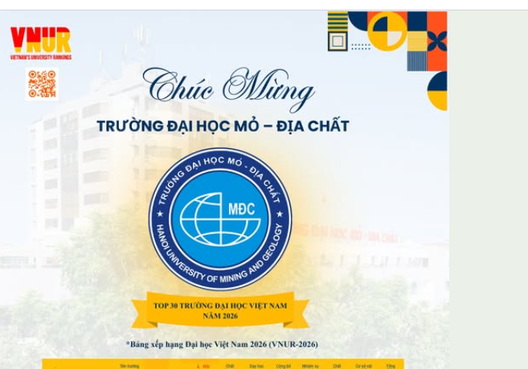

# CHƯƠNG 4. ĐẶC TẢ USE CASE HỆ THỐNG QUẢN LÝ THƯ VIỆN

---

## 4.0. Sơ đồ tổng quát hệ thống (Use Case Diagram)

Sơ đồ Use Case tổng quát mô tả toàn bộ các chức năng chính của hệ thống Quản lý Thư viện và mối quan hệ tương tác giữa các Actor và hệ thống. Sơ đồ này giúp xác định phạm vi chức năng, tránh thiếu hoặc trùng lặp yêu cầu trong quá trình phân tích.

### Các Actor trong hệ thống

| Actor            | Mô tả quyền hạn                                                                                    |
| ---------------- | ------------------------------------------------------------------------------------------------------ |
| Bạn đọc       | Tìm kiếm sách, mượn sách, trả sách, gia hạn mượn, đặt trước sách, xem lịch sử mượn |
| Thủ thư        | Quản lý sách, quản lý mượn – trả, quản lý thông tin bạn đọc                             |
| Quản trị viên | Quản lý tài khoản nhân viên, cấu hình hệ thống, báo cáo – thống kê, sao lưu dữ liệu  |

Sơ đồ Use Case tổng quát là cơ sở để xây dựng các sơ đồ chi tiết như **Sequence Diagram** và **Activity Diagram** cho từng chức năng cụ thể.

---

## 4.2. ĐẶC TẢ USE CASE: ĐĂNG NHẬP

### Thông tin chung

| Thuộc tính        | Nội dung                                                                 |
| ------------------- | ------------------------------------------------------------------------- |
| Tên Use Case       | Đăng nhập                                                              |
| Mô tả             | Cho phép người dùng truy cập vào hệ thống theo đúng quyền hạn |
| Actor chính        | Bạn đọc, Thủ thư, Quản trị viên                                   |
| Actor phụ          | Hệ thống xác thực                                                     |
| Mục tiêu          | Xác thực người dùng và phân quyền truy cập                       |
| Mức độ ưu tiên | Cao                                                                       |

### Điều kiện

| Loại              | Mô tả                                                                      |
| ------------------ | ---------------------------------------------------------------------------- |
| Tiền điều kiện | Người dùng đã có tài khoản hợp lệ và chưa đăng nhập           |
| Hậu điều kiện  | Người dùng được đăng nhập thành công hoặc nhận thông báo lỗi |

### Luồng sự kiện chính

1. Người dùng truy cập trang đăng nhập.
2. Người dùng nhập **username** và  **password** .
3. Người dùng nhấn nút  **Đăng nhập** .
4. Hệ thống kiểm tra tính hợp lệ của thông tin.
5. Hệ thống xác định quyền người dùng.
6. Chuyển đến giao diện chức năng tương ứng.

### Luồng sự kiện phụ / Ngoại lệ

* **A1: Sai thông tin đăng nhập**
  1. Username hoặc password không đúng.
  2. Hệ thống hiển thị thông báo lỗi.
* **A2: Tài khoản bị khóa**
  1. Hệ thống thông báo tài khoản không khả dụng.

### Quy tắc nghiệp vụ

* Mật khẩu phải được mã hóa trong CSDL.
* Một tài khoản đăng nhập không quá 5 lần sai liên tiếp.

### Dữ liệu vào/ra

* Dữ liệu vào: username, password
* Dữ liệu ra: thông tin người dùng, quyền hạn

---

## 4.3. ĐẶC TẢ USE CASE: QUẢN LÝ SÁCH

### Thông tin chung

| Thuộc tính        | Nội dung                                   |
| ------------------- | ------------------------------------------- |
| Tên Use Case       | Quản lý sách                             |
| Mô tả             | Quản lý thông tin sách trong thư viện |
| Actor chính        | Thủ thư, Quản trị viên                 |
| Mục tiêu          | Cập nhật danh mục sách chính xác      |
| Mức độ ưu tiên | Cao                                         |

### Điều kiện

| Loại              | Mô tả                                               |
| ------------------ | ----------------------------------------------------- |
| Tiền điều kiện | Người dùng đã đăng nhập với quyền quản lý |
| Hậu điều kiện  | Thông tin sách được thêm/sửa/xóa trong CSDL   |

### Luồng sự kiện chính

1. Thủ thư chọn chức năng  **Quản lý sách** .
2. Chọn thao tác: Thêm / Sửa / Xóa sách.
3. Nhập hoặc chỉnh sửa thông tin sách (mã sách, tên sách, tác giả, NXB, số lượng…).
4. Hệ thống kiểm tra dữ liệu.
5. Lưu thông tin vào hệ thống.

### Luồng sự kiện phụ

* **B1: Dữ liệu không hợp lệ**
  1. Thiếu thông tin hoặc trùng mã sách.
  2. Hệ thống thông báo lỗi và yêu cầu nhập lại.

### Quy tắc nghiệp vụ

* Mã sách là duy nhất.
* Không được xóa sách đang được mượn.

---

## 4.4. ĐẶC TẢ USE CASE: MƯỢN SÁCH

### Thông tin chung

| Thuộc tính        | Nội dung                    |
| ------------------- | ---------------------------- |
| Tên Use Case       | Mượn sách                 |
| Actor chính        | Bạn đọc, Thủ thư        |
| Mục tiêu          | Ghi nhận việc mượn sách |
| Mức độ ưu tiên | Cao                          |

### Điều kiện

| Loại              | Mô tả                                                                      |
| ------------------ | ---------------------------------------------------------------------------- |
| Tiền điều kiện | Bạn đọc đã đăng nhập và còn quyền mượn sách                    |
| Hậu điều kiện  | Phiếu mượn được tạo, sách chuyển sang trạng thái “Đang mượn” |

### Luồng sự kiện chính

1. Bạn đọc chọn sách cần mượn.
2. Gửi yêu cầu mượn sách.
3. Hệ thống kiểm tra số lượng và điều kiện mượn.
4. Lập phiếu mượn.
5. Cập nhật trạng thái sách.

### Luồng sự kiện phụ

* **C1: Sách đã hết** → Thông báo không thể mượn.
* **C2: Vượt quá số sách cho phép** → Từ chối yêu cầu.

### Quy tắc nghiệp vụ

* Mỗi bạn đọc chỉ được mượn tối đa N cuốn.
* Thời hạn mượn là X ngày.

---

## 4.5. ĐẶC TẢ USE CASE: TRẢ SÁCH

### Thông tin chung

| Thuộc tính  | Nội dung                  |
| ------------- | -------------------------- |
| Tên Use Case | Trả sách                 |
| Actor chính  | Bạn đọc, Thủ thư      |
| Mục tiêu    | Ghi nhận việc trả sách |

### Luồng sự kiện chính

1. Người dùng chọn chức năng  **Trả sách** .
2. Nhập mã phiếu mượn.
3. Hệ thống xác nhận thông tin.
4. Cập nhật trạng thái sách.

### Luồng sự kiện phụ

* **D1: Trả sách quá hạn** → Hệ thống tính tiền phạt.

### Quy tắc nghiệp vụ

* Tiền phạt = số ngày trễ × mức phạt/ngày.

---

## 4.6. ĐẶC TẢ USE CASE: TÌM KIẾM SÁCH

### Luồng sự kiện chính

1. Người dùng nhập từ khóa.
2. Chọn tiêu chí (tên sách, tác giả, thể loại…).
3. Hệ thống xử lý.
4. Hiển thị kết quả.

### Luồng sự kiện phụ

* Không có kết quả → Thông báo cho người dùng.

---

## 4.7. ĐẶC TẢ USE CASE: QUẢN LÝ BẠN ĐỌC

### Luồng sự kiện chính

1. Thủ thư chọn chức năng  **Quản lý bạn đọc** .
2. Thêm / Sửa / Xóa thông tin bạn đọc.
3. Hệ thống kiểm tra dữ liệu.
4. Lưu thông tin.

### Quy tắc nghiệp vụ

* Mã bạn đọc là duy nhất.
* Không xóa bạn đọc đang mượn sách.

---

## 4.8. ĐẶC TẢ USE CASE BỔ SUNG (MỞ RỘNG)

### 4.8.1. ĐẶC TẢ USE CASE: GIA HẠN MƯỢN SÁCH

#### Thông tin chung

| Thuộc tính        | Nội dung                                                          |
| ------------------- | ------------------------------------------------------------------ |
| Tên Use Case       | Gia hạn mượn sách                                              |
| Mô tả             | Cho phép bạn đọc gia hạn thời gian mượn sách đang mượn |
| Actor chính        | Bạn đọc, Thủ thư                                              |
| Mục tiêu          | Kéo dài thời gian mượn sách theo quy định                  |
| Mức độ ưu tiên | Trung bình                                                        |

#### Điều kiện

| Loại              | Mô tả                                        |
| ------------------ | ---------------------------------------------- |
| Tiền điều kiện | Sách đang được mượn và chưa quá hạn |
| Hậu điều kiện  | Thời hạn trả sách được cập nhật       |

#### Luồng sự kiện chính

1. Bạn đọc chọn chức năng  **Gia hạn mượn sách** .
2. Nhập mã phiếu mượn cần gia hạn.
3. Hệ thống kiểm tra điều kiện gia hạn.
4. Hệ thống cập nhật ngày trả mới.
5. Thông báo gia hạn thành công.

#### Luồng sự kiện phụ

* **E1: Không đủ điều kiện gia hạn** → Hệ thống từ chối và hiển thị lý do.

#### Quy tắc nghiệp vụ

* Mỗi phiếu mượn chỉ được gia hạn tối đa 1 lần.
* Không cho phép gia hạn sách đã có người đặt trước.

---

### 4.8.2. ĐẶC TẢ USE CASE: ĐẶT TRƯỚC SÁCH

#### Thông tin chung

| Thuộc tính        | Nội dung                                                     |
| ------------------- | ------------------------------------------------------------- |
| Tên Use Case       | Đặt trước sách                                           |
| Mô tả             | Cho phép bạn đọc đặt trước sách đang được mượn |
| Actor chính        | Bạn đọc                                                    |
| Mục tiêu          | Đảm bảo quyền mượn sách khi sách được trả         |
| Mức độ ưu tiên | Trung bình                                                   |

#### Điều kiện

| Loại              | Mô tả                                               |
| ------------------ | ----------------------------------------------------- |
| Tiền điều kiện | Sách đang ở trạng thái “Đang mượn”          |
| Hậu điều kiện  | Yêu cầu đặt trước được lưu trong hệ thống |

#### Luồng sự kiện chính

1. Bạn đọc tìm kiếm và chọn sách cần đặt trước.
2. Chọn chức năng  **Đặt trước** .
3. Hệ thống kiểm tra số lượng người đặt trước.
4. Ghi nhận yêu cầu đặt trước.
5. Thông báo đặt trước thành công.

#### Luồng sự kiện phụ

* **F1: Số lượng đặt trước đạt giới hạn** → Hệ thống từ chối yêu cầu.

#### Quy tắc nghiệp vụ

* Mỗi sách chỉ cho phép tối đa N lượt đặt trước.
* Ưu tiên theo thứ tự thời gian đăng ký.

---

### 4.8.3. ĐẶC TẢ USE CASE: BÁO CÁO – THỐNG KÊ

#### Thông tin chung

| Thuộc tính        | Nội dung                                               |
| ------------------- | ------------------------------------------------------- |
| Tên Use Case       | Báo cáo – Thống kê                                 |
| Mô tả             | Cung cấp các báo cáo tổng hợp phục vụ quản lý |
| Actor chính        | Quản trị viên                                        |
| Mục tiêu          | Hỗ trợ công tác quản lý và ra quyết định      |
| Mức độ ưu tiên | Trung bình                                             |

#### Điều kiện

| Loại              | Mô tả                                       |
| ------------------ | --------------------------------------------- |
| Tiền điều kiện | Quản trị viên đã đăng nhập            |
| Hậu điều kiện  | Báo cáo được hiển thị hoặc xuất file |

#### Luồng sự kiện chính

1. Quản trị viên chọn chức năng  **Báo cáo – Thống kê** .
2. Lựa chọn loại báo cáo (sách mượn nhiều, quá hạn, tồn kho…).
3. Hệ thống tổng hợp dữ liệu.
4. Hiển thị báo cáo hoặc xuất file.

#### Quy tắc nghiệp vụ

* Dữ liệu báo cáo phải phản ánh đúng thời điểm truy vấn.
* Chỉ quản trị viên mới có quyền truy cập chức năng này.

## 4.9. Kết luận chương

Chương 4 đã trình bày đầy đủ và chi tiết các Use Case của hệ thống Quản lý Thư viện, bao gồm các chức năng cơ bản và các Use Case mở rộng nhằm phản ánh sát hơn hoạt động thực tế của thư viện. Những đặc tả này là cơ sở quan trọng cho việc xây dựng các sơ đồ UML chi tiết, thiết kế cơ sở dữ liệu và triển khai hệ thống trong các giai đoạn tiếp theo.

